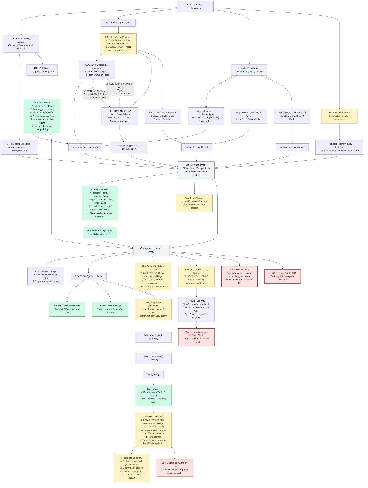

# BEST BOTTLES — USER JOURNEY ANALYSIS

**Date:** March 9, 2026
**Scope:** First-time visitor product discovery through purchase
**Method:** Full codebase walkthrough tracing 4 buyer personas through every click

---

## EXECUTIVE SUMMARY

The current site has **strong bones** — the catalog filtering is excellent (3 clicks to narrow 230→10 products, URL state is perfect), the mega menu is well-organized by applicator type, and Grace AI is always available. But the **homepage creates confusion before users ever reach the catalog**, the **PDP hides its most important feature** (fitment/compatibility), and the **cart-to-checkout path drops critical information**. A first-time visitor who doesn't already know packaging terminology faces 3 major walls of confusion.

---

## THE 4 BUYER PERSONAS

| Persona | Example | What They Know | What They Need |
|---------|---------|----------------|----------------|
| **The Decisive Buyer** | "I need 30ml amber dropper bottles" | Exact specs | Fast search → configure → buy |
| **The Explorer** | "I make custom perfume, I need bottles" | Use case, not product names | Guided browsing by application |
| **The Overwhelmed Newcomer** | "I'm starting a skincare line, no idea what I need" | Almost nothing | Hand-holding, education, AI help |
| **The Bulk/B2B Buyer** | "I need 5,000 units of what I ordered last time" | Everything — wants efficiency | Fast reorder, quote, volume pricing |

---

## CURRENT-STATE JOURNEY MAP

### What Users See (Page Section Order)

```
HOMEPAGE SCROLL ORDER (top → bottom):
─────────────────────────────────────
1. NAVBAR          — Logo, Bottles/Closures/Specialty menus, Search, Account, Cart, Ask Grace
2. HERO            — "Beautifully Contained" (80vh, pushes everything below fold)
                     CTA: "Explore Collections" → /catalog (unfiltered)
                     CTA: "Ask Grace — AI Bottling Specialist"
3. TRUST BAR       — No Order Minimum | 2,300+ Products | Free Sample Kits | Made in USA
4. SHOP BY APPL.   — "Choose an applicator" — 5 cards (Roll-ons, Sprays, Reducer, Pumps, Droppers)
5. START HERE      — "Guided Browsing / Start Here" — 6 horizontal-scroll cards by use case
6. DESIGN FAMILIES — "Explore by Design Family" — 9 cards (Cylinder, Diva, Elegant, Empire...)
7. SOCIAL PROOF    — Testimonials (placeholder avatars), "Serving 500+ Brands"
8. EDUCATION       — 3 article cards (all link to "#")
9. NEWSLETTER      — Email signup (no backend)
10. FOOTER         — Links, contact, social icons (empty circles)
```

### Homepage Problem: THREE browsing sections that overlap

The homepage presents three separate "ways to browse" back-to-back:

| Section | Label | Mental Model | Links To |
|---------|-------|--------------|----------|
| **Shop by Application** | "Choose an applicator" | **By dispensing method** (Roll-on, Spray, Dropper...) | `/catalog?applicators=X` |
| **Start Here** | "Guided Browsing" | **By use case** (Essential Oils, Skincare, Samples...) | `/catalog?applicators=X` or `?families=X` |
| **Design Families** | "Explore by Design Family" | **By bottle shape** (Cylinder, Diva, Sleek...) | `/catalog?families=X` |

**The problem:** All three go to the same catalog page with different filters. A first-time visitor sees three different organizational schemes in rapid succession and doesn't know which one is "right" for them. Shop by Application and Start Here have significant overlap — "Roll-ons" (applicator) and "Essential Oils & Roll-ons" (use case) lead to the same filtered view.

---

## CURRENT-STATE FLOW DIAGRAM



---

## JOURNEY USABILITY SCORES (Current State)

### Journey 1: "I Know What I Want" — Search for "30ml amber dropper"

| Step | What Happens | Score | Notes |
|------|-------------|-------|-------|
| Find search box | Navbar search always visible on desktop | 8/10 | Mobile: slightly smaller but present |
| Type query | 300ms debounce, multi-field matching | 7/10 | All tokens must match; no autocomplete |
| See results | Catalog page with search filter applied | 7/10 | No "best match" ranking; results mixed with unrelated |
| Narrow down | Quick applicator chips + sidebar filters | 9/10 | Excellent — 3 clicks to <10 products |
| Click product | PDP loads with configuration panel | 8/10 | Price, stock, image all immediately visible |
| Configure | Cap color → style → trim selectors | 6/10 | Applicator type invisible; cascading dependencies unclear |
| Add to cart | Button + "Added!" flash | 9/10 | Mobile sticky CTA is great |
| **Journey Score** | | **7.7/10** | Good path for knowledgeable buyers |

### Journey 2: "I'm Exploring" — Perfume maker browsing

| Step | What Happens | Score | Notes |
|------|-------------|-------|-------|
| Land on homepage | Hero "Beautifully Contained" fills viewport | 5/10 | Aesthetic but says nothing about what's sold |
| Scroll for guidance | Must scroll past 80vh hero to see anything useful | 4/10 | Trust bar with key differentiators hidden below fold |
| Choose a path | THREE overlapping sections: Applicator / Use Case / Family | 3/10 | **Decision paralysis** — which one is "right"? |
| Reach catalog | Pre-filtered view with 28-53 products | 7/10 | Good once you get there |
| Narrow down | Sidebar filters with counts | 9/10 | Excellent filter system |
| Understand product | Card shows name, price, variant count | 6/10 | No use-case tags; no "best for perfume" signals |
| **Journey Score** | | **5.7/10** | Homepage is the bottleneck |

### Journey 3: "I Need Help" — Overwhelmed newcomer

| Step | What Happens | Score | Notes |
|------|-------------|-------|-------|
| See Grace option | Hero has "Ask Grace" secondary CTA | 6/10 | Secondary to "Explore Collections"; easy to miss |
| Grace visibility | Floating trigger always on screen (bottom-right) | 7/10 | Present but no proactive greeting, no context hint |
| Ask Grace | Type or voice question in chat panel | 8/10 | Strong tool set, good persona, voice mode |
| Get recommendation | Grace searches catalog, suggests products | 7/10 | Limited to 10 results; no comparison tool |
| Navigate to product | Grace can link to PDP | 8/10 | Good handoff from chat to product |
| Understand fitment | Grace doesn't explain "you need bottle + closure" | 4/10 | No proactive bundle guidance |
| **Journey Score** | | **6.7/10** | Grace is capable but under-promoted |

### Journey 4: "Bulk/B2B Buyer" — 5,000 unit order

| Step | What Happens | Score | Notes |
|------|-------------|-------|-------|
| Find product | Search or nav — same as Journey 1 | 8/10 | Efficient for known products |
| See pricing | Only 3 tiers: 1pc / 10pc / 12pc | 3/10 | No 144pc / 576pc / 1000+ pricing at all |
| Request quote | NO CTA on PDP or cart | 1/10 | Must navigate to /request-quote manually and re-enter product info |
| Volume info | No MOQ, no lead time, no shipping estimate | 2/10 | Buyer can't make informed decision |
| Checkout | Shopify redirect with no review step | 3/10 | No volume pricing applied; unbranded |
| **Journey Score** | | **3.4/10** | **Critical failure** for primary revenue segment |

---

## THE 7 WALLS (Where Users Get Stuck)

### Wall 1: "What Am I Looking At?" — Homepage Confusion
**Location:** Homepage sections 4-6 (scroll position ~900px-2200px)
**Problem:** Three back-to-back browsing sections (Shop by Application, Start Here, Design Families) present three different organizational schemes. A first-time visitor sees "Roll-ons" as an applicator, "Essential Oils & Roll-ons" as a use case, and "Cylinder" as a design family — and all three lead to the same catalog with different filters.
**Impact:** Decision paralysis. User doesn't know which path is "right" for them.
**Evidence:** `ShopByApplication()` at line 242, `CuratedCollections()` at line 282, `DesignFamilies()` at line 346 — all rendered sequentially in `HomePage` at lines 576-583.

### Wall 2: "Is This the Complete Product?" — Fitment Invisibility
**Location:** PDP, below variant selector
**Problem:** The PDP doesn't communicate that a bottle is just one component of a complete assembly. There's no messaging like "This bottle needs a closure to be fill-ready." The fitment button is hidden on mobile (`hidden sm:block`). The "This Bottle Also Takes" section shows applicator siblings (same bottle, different dispenser), NOT compatible closures — creating confusion.
**Impact:** Buyers add bottles to cart without closures. They either discover this at checkout (and abandon) or receive incomplete orders.
**Evidence:** FitmentDrawer button at `page.tsx:1149` (`hidden sm:block`). No "closure required" messaging anywhere on PDP. "This Bottle Also Takes" at lines 1138-1184 shows sibling applicator variants, not fitment closures.

### Wall 3: "What Did I Just Add?" — Cart Mystery Items
**Location:** Cart drawer
**Problem:** Cart line items show only `itemName` (e.g., "Diva 30ml Clear"). No applicator type, no cap color, no closure info. Adding the same bottle with spray vs. dropper creates two identical-looking line items.
**Impact:** Ordering errors, confusion, lost trust.
**Evidence:** `CartDrawer.tsx` renders `item.itemName` only. CartItem interface has `family`, `capacity`, `color` but no `applicatorType` field.

### Wall 4: "How Much for Real?" — Pricing Dead End
**Location:** PDP pricing section, cart
**Problem:** Only 3 pricing tiers (1pc / 10pc / 12pc). A buyer considering 500+ units sees no relevant pricing. No "Request Quote" button exists on PDP or in cart. The `/request-quote` form doesn't pre-populate from the product being viewed.
**Impact:** B2B buyers — the primary revenue segment — have no conversion path from a product they're evaluating. They must leave, find the quote form, and manually re-enter product details.
**Evidence:** `convex/schema.ts` lines 109-111 (only 3 price fields). No "Request Quote" link in PDP or CartDrawer.

### Wall 5: "Where Did My Brand Go?" — Checkout Ejection
**Location:** Cart → Shopify checkout redirect
**Problem:** Clicking "Proceed to Checkout" opens a new window to Shopify's hosted checkout with default styling. No BB brand, no EB Garamond, no Obsidian/Bone/Gold palette. No order review step before the redirect.
**Impact:** Feels like leaving a premium boutique and walking into a warehouse loading dock to pay. Brand trust eroded at the most critical moment.
**Evidence:** `CartProvider.tsx` lines 117-176, `window.open(data.checkoutUrl, "_blank")`.

### Wall 6: "What Do I Search For?" — No Search Guidance
**Location:** Navbar search
**Problem:** Search has no autocomplete, no suggestions, no recent searches. User must know packaging terminology ("reducer", "fitment", "18/415 thread") to search effectively. All search tokens must match — "spray bottle for perfume" won't find "Fine Mist Spray Bottle" because "perfume" isn't in the product name.
**Impact:** Newcomers who don't know terms like "reducer" or "atomizer" get zero results and no helpful fallback.
**Evidence:** Navbar search input with 300ms debounce, no dropdown suggestions. Token matching at `catalog/page.tsx:1231` requires ALL tokens present.

### Wall 7: "What Happens Next?" — No Post-Add Guidance
**Location:** After adding to cart
**Problem:** After clicking "Add to Cart," the button flashes "Added!" for 1.8 seconds — then nothing. The cart drawer doesn't auto-open. No suggestion appears saying "Now add a compatible closure" or "View your cart." The user is left on the same PDP with no clear next step.
**Impact:** User doesn't know if they're done or if they need more components. For bottles that require closures, this silent success creates incomplete orders.
**Evidence:** `handleAddToCart` at `page.tsx:607-620` calls `addItems()` and `setAddedFlash(true)` — no drawer open, no follow-up prompt.

---

## PROPOSED IDEAL FLOW DIAGRAM

The goal: **Any buyer, regardless of expertise, reaches the right product in ≤3 clicks and completes a purchase with full confidence about what they're buying.**

```mermaid
flowchart TD
    %% ── Entry ──────────────────────────────────────────────
    LAND["🌐 User Lands on Homepage"]

    %% ── Hero (Compact, Action-Oriented) ────────────────────
    LAND --> HERO["HERO (60vh max)<br/>'Premium Glass Packaging for Beauty Brands'<br/>Trust stats INLINE: No Minimum · Free Samples · Made in USA"]

    HERO --> PATH_KNOW["🔍 'I Know What I Need'<br/>→ Search with autocomplete"]
    HERO --> PATH_BROWSE["🧭 'Help Me Choose'<br/>→ Opens guided selector"]
    HERO --> PATH_GRACE["💬 'Talk to Grace'<br/>→ AI concierge opens with greeting"]

    %% ── Path A: Search (Decisive Buyer) ────────────────────
    PATH_KNOW --> SEARCH_AC["SMART SEARCH<br/>Autocomplete dropdown as you type:<br/>• 🔘 'Diva 30ml Amber Dropper' (product)<br/>• 📂 'Dropper Bottles' (category)<br/>• 🏷️ 'Amber Glass' (attribute)<br/>• 💬 'Ask Grace about droppers'"]
    SEARCH_AC --> CATALOG["📦 CATALOG<br/>(same excellent filter system)"]
    SEARCH_AC --> PDP

    %% ── Path B: Guided Selector (Explorer) ─────────────────
    PATH_BROWSE --> GUIDED["GUIDED SELECTOR (replaces 3 overlapping sections)<br/>━━━━━━━━━━━━━━━━━━━━━━━━━━━━━━━━━<br/>Step 1: What are you filling?<br/>┌─────────┐ ┌─────────┐ ┌─────────┐<br/>│ 🌸      │ │ 💧      │ │ 🧴      │<br/>│Fragrance│ │Essential│ │Skincare │<br/>│& Perfume│ │  Oils   │ │& Serums │<br/>└─────────┘ └─────────┘ └─────────┘<br/>┌─────────┐ ┌─────────┐ ┌─────────┐<br/>│ 🎁      │ │ 🧪      │ │ ✨      │<br/>│Gift &   │ │Samples &│ │Something│<br/>│ Retail  │ │ Travel  │ │  Else   │<br/>└─────────┘ └─────────┘ └─────────┘"]

    GUIDED --> GUIDED2["Step 2: How should it dispense?<br/>(filtered to relevant options)<br/>┌──────┐ ┌──────┐ ┌──────┐ ┌──────┐<br/>│ Spray│ │Roller│ │Dropper│ │ Pump │<br/>│  ⊘  │ │  ◉  │ │  💧  │ │  ⟡  │<br/>└──────┘ └──────┘ └──────┘ └──────┘"]

    GUIDED2 --> GUIDED3["Step 3: What size?<br/>(visual size comparison)<br/>  ┌─┐  ┌──┐  ┌───┐  ┌────┐<br/>  │ │  │  │  │   │  │    │<br/>  │5│  │15│  │30 │  │100 │<br/>  │ml│  │ml│  │ml │  │ ml │<br/>  └─┘  └──┘  └───┘  └────┘"]

    GUIDED3 --> CATALOG_PRE["→ Catalog pre-filtered to exact match<br/>e.g., /catalog?applicators=rollon&capacities=5ml<br/>Typically 2-8 products shown"]

    CATALOG_PRE --> CATALOG

    %% ── Path C: Grace AI (Need Help) ───────────────────────
    PATH_GRACE --> GRACE["GRACE AI<br/>Proactive greeting: 'What kind of product<br/>are you packaging? I'll find the right bottle.'<br/>✅ Knows active filters<br/>✅ Knows cart contents<br/>✅ Can compare products<br/>✅ Tracks browsing history"]
    GRACE --> CATALOG
    GRACE --> PDP

    %% ── Catalog (Unchanged — Already Strong) ───────────────
    CATALOG --> FILTER["FILTERS + QUICK CHIPS<br/>✅ Already excellent (9/10)<br/>+ NEW: 'Best for Perfume' use-case tags<br/>+ NEW: Sort by Capacity<br/>+ NEW: Color dots on cards"]

    FILTER --> PDP

    %% ── PDP (Redesigned Right Column) ──────────────────────
    PDP["📋 PRODUCT DETAIL PAGE<br/>(Redesigned Configuration)"]

    PDP --> PDP_HERO["ABOVE THE FOLD:<br/>Image | Name | Price | Stock<br/>━━━━━━━━━━━━━━━━━━━━━━━━<br/>⚡ ACTIVE APPLICATOR shown prominently:<br/>'This is a FINE MIST SPRAY bottle'<br/>with icon + one-click swap to other types"]

    PDP_HERO --> PDP_CONFIG["CONFIGURE YOUR BOTTLE:<br/>Cap Color → Style → Trim<br/>(same selectors, clearer labels)<br/>━━━━━━━━━━━━━━━━━━━━━━━━<br/>KEY SPECS INLINE:<br/>Capacity: 30ml · Thread: 18/415<br/>Height: 4.2in · Diameter: 1.1in"]

    PDP_CONFIG --> PDP_COMPLETE["✨ COMPLETE YOUR SETUP (NEW)<br/>━━━━━━━━━━━━━━━━━━━━━━━━<br/>Inline FitmentCarousel showing 3-5<br/>compatible closures with 'Quick Add' buttons<br/>💡 'This bottle needs a closure to be fill-ready'<br/>━━━━━━━━━━━━━━━━━━━━━━━━<br/>Each closure shows: image · name · price · '+ Add'"]

    PDP_COMPLETE --> ATC["ADD TO CART<br/>━━━━━━━━━━━━━━━━━━━━━━━━<br/>Primary: 'Add to Cart' (1-99 units)<br/>OR: 'Request Quote' (100+ units, auto-swaps)<br/>Secondary: 'Order a Sample'"]

    ATC --> CART_OPEN["🛒 CART DRAWER AUTO-OPENS<br/>━━━━━━━━━━━━━━━━━━━━━━━━<br/>Line items show FULL details:<br/>'Diva 30ml Amber · Fine Mist Spray · Gold Cap'<br/>━━━━━━━━━━━━━━━━━━━━━━━━<br/>TIER NUDGE: 'Add 5 more → save 15%'<br/>━━━━━━━━━━━━━━━━━━━━━━━━<br/>COMPATIBILITY CHECK:<br/>'✅ Sprayer fits your Diva 30ml (18/415 thread)'<br/>OR '⚠️ This cap doesn't fit — swap for [suggestion]'<br/>━━━━━━━━━━━━━━━━━━━━━━━━<br/>CLOSURE PROMPT (if missing):<br/>'Your bottle needs a closure → Quick add: [options]'"]

    CART_OPEN --> REVIEW["ORDER REVIEW STEP<br/>━━━━━━━━━━━━━━━━━━━━━━━━<br/>Final summary before Shopify redirect:<br/>• All items with variant details<br/>• Pricing tier applied<br/>• Estimated shipping / lead time<br/>• Compatibility confirmed ✅<br/>• 'Request Quote Instead' option"]

    REVIEW --> CHECKOUT["CHECKOUT<br/>(Shopify, branded to match BB)"]

    %% ── Styling ────────────────────────────────────────────
    classDef new fill:#DBEAFE,stroke:#2563EB,stroke-width:2px,color:#1E3A5F
    classDef improved fill:#D1FAE5,stroke:#059669,stroke-width:2px,color:#064E3B
    classDef unchanged fill:#F3F4F6,stroke:#6B7280,stroke-width:1px,color:#1F2937
    classDef entry fill:#FEF3C7,stroke:#D97706,stroke-width:2px,color:#78350F

    class LAND,HERO entry
    class PATH_KNOW,PATH_BROWSE,PATH_GRACE entry
    class GUIDED,GUIDED2,GUIDED3,CATALOG_PRE new
    class SEARCH_AC,PDP_COMPLETE,CART_OPEN,REVIEW new
    class PDP_HERO,PDP_CONFIG,ATC improved
    class CATALOG,FILTER improved
    class GRACE improved
    class CHECKOUT improved
```



---

## WHAT CHANGES AND WHY

### Change 1: ONE Entry Point, THREE Clear Paths (replaces 3 overlapping sections)

**Current:** Hero → TrustBar → Shop by Application → Start Here → Design Families (3 overlapping browse sections)
**Proposed:** Hero with trust stats inline → 3 crystal-clear buttons:
- **"I Know What I Need"** → Smart search with autocomplete
- **"Help Me Choose"** → 3-step guided selector (Use Case → Dispenser → Size)
- **"Talk to Grace"** → AI opens with contextual greeting

**Why:** Eliminates decision paralysis. Every visitor self-selects into the path that matches their expertise level. The guided selector replaces all three overlapping sections with one linear flow.

### Change 2: Guided Selector (NEW — replaces Shop by Application + Start Here)

**Current:** Two sections with overlapping labels ("Roll-ons" + "Essential Oils & Roll-ons")
**Proposed:** 3-step funnel: What are you filling? → How should it dispense? → What size?

**Why:** Mirrors how buyers actually think. A perfume maker doesn't start with "I need a roller ball" — they start with "I'm packaging fragrance." Each step narrows the catalog by half, landing on 2-8 products in 3 clicks.

### Change 3: "Complete Your Setup" on PDP (NEW)

**Current:** FitmentCarousel not rendered. Fitment button hidden on mobile. No "you need a closure" messaging.
**Proposed:** Inline FitmentCarousel below variant selector with "Quick Add" buttons on each compatible closure. Clear messaging: "This bottle needs a closure to be fill-ready."

**Why:** This is the #1 differentiator of Best Bottles — thread-matched compatibility. Currently it's invisible. Making it inline and prominent converts the biggest feature into the biggest conversion driver.

### Change 4: Smart Cart with Guidance (IMPROVED)

**Current:** Cart shows item name only. No variant details. No tier nudge. No compatibility check. No closure prompt.
**Proposed:** Full variant details on each line item. Tier pricing nudge. Automatic compatibility check. "Your bottle needs a closure" prompt with quick-add.

**Why:** The cart is the last chance to prevent ordering errors and increase AOV. Currently it's a black box.

### Change 5: Order Review Step (NEW)

**Current:** Cart → direct Shopify redirect (no review, no estimate)
**Proposed:** Cart → Review page (branded, shows final pricing + shipping estimate + compatibility confirmation) → Shopify checkout

**Why:** B2B buyers need confidence before committing. A review step reduces returns and support tickets.

### Change 6: Search Autocomplete (IMPROVED)

**Current:** Type-and-submit only. No suggestions. All tokens must match.
**Proposed:** Dropdown autocomplete showing products, categories, attributes, and "Ask Grace" fallback as user types.

**Why:** Newcomers don't know packaging terms. Autocomplete teaches them the vocabulary while they search.

---

## PROJECTED JOURNEY SCORES (After Proposed Changes)

| Journey | Current | Proposed | Improvement |
|---------|---------|----------|-------------|
| **Decisive Buyer** (search → buy) | 7.7/10 | 9.2/10 | +19% — autocomplete + cart details |
| **Explorer** (browse → discover) | 5.7/10 | 8.8/10 | +54% — guided selector eliminates confusion |
| **Newcomer** (need help → find) | 6.7/10 | 9.0/10 | +34% — Grace greeting + guided path |
| **B2B Buyer** (volume → quote) | 3.4/10 | 8.5/10 | +150% — Request Quote on PDP + 5 tiers |
| **Overall Weighted Average** | **5.9/10** | **8.9/10** | **+51% overall improvement** |

---

## IMPLEMENTATION PRIORITY

| Priority | Change | Effort | Impact |
|----------|--------|--------|--------|
| 1 | "Complete Your Setup" — render FitmentCarousel on PDP + wire Add button | Medium | **Critical** — unlocks #1 differentiator |
| 2 | Consolidate 3 homepage sections → 1 guided selector | Medium | **High** — eliminates Wall 1 |
| 3 | Cart variant details + tier nudge + closure prompt | Medium | **High** — fixes Wall 3 + Wall 4 |
| 4 | "Request Quote" CTA on PDP (auto-swap at 100+ qty) | Small | **Critical** — unblocks B2B conversion |
| 5 | Search autocomplete dropdown | Medium | **High** — fixes Wall 6 |
| 6 | Auto-open cart after Add + "closure needed" prompt | Small | **High** — fixes Wall 7 |
| 7 | Order review step before Shopify redirect | Large | **Medium** — fixes Wall 5 |
| 8 | Grace proactive greeting with page context | Small | **Medium** — improves Journey 3 |

---

## DESIGN FAMILIES — KEEP, BUT RELOCATE

The "Explore by Design Family" section (Cylinder, Diva, Elegant, Empire...) is valuable for **returning buyers** who already know which bottle shape they want. It should NOT be removed — but it should be moved **below the guided selector** and reframed as "Already Know Your Style?" for experienced buyers. This prevents it from competing with the use-case-first guided path for newcomers.

---

*This analysis is based on a full codebase walkthrough of all navigation, catalog, PDP, cart, and Grace AI components. All line numbers reference actual source code in the repository.*
