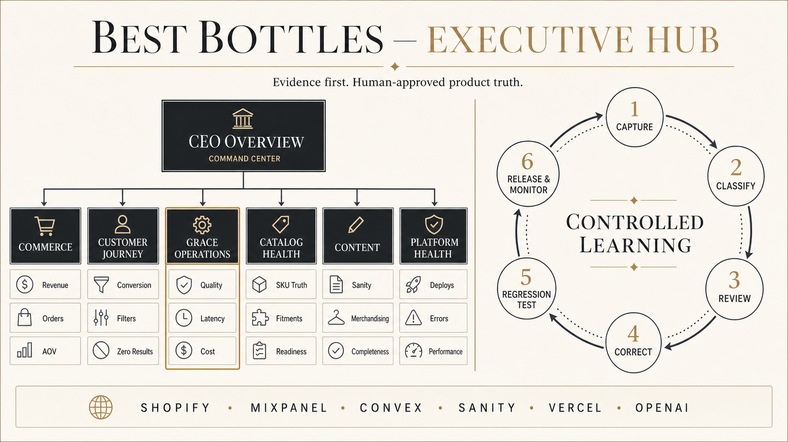
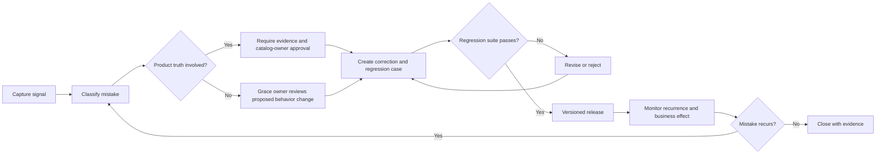

# Best Bottles Executive Hub and Grace Operations

Status: Approved design direction
Date: 2026-08-02
Audience: Best Bottles leadership, Grace product owner, catalog operations, engineering
Existing implementation shell: `src/app/executive/page.tsx`



## 1. Decision

Best Bottles will establish the Executive Hub as the leadership operating system for the business. Grace Operations is a first-class operating lane inside that hub, not a standalone AI-cost dashboard.

Grace will use controlled learning. Customer feedback and observed failures create learning candidates, but no individual conversation can directly rewrite Grace's instructions, catalog truth, compatibility rules, pricing, inventory, or production behavior.

The hub must make the next leadership decision visible in under one minute, then provide drill-downs for operators. It must never manufacture a live value from a schema, stale snapshot, checkout redirect, or inferred event.

## 2. Product principles

1. **Outcomes before activity.** The CEO view leads with business outcomes and material risks, not raw event volume.
2. **One owner for every fact.** Shopify owns completed commerce; Mixpanel owns behavior; Convex owns catalog and Grace operations; Sanity owns content; Vercel owns production health; OpenAI owns billed API usage and cost.
3. **Grace inherits customer context.** Voice and text use the exact active catalog filter state unless the customer explicitly broadens or changes it.
4. **Evidence before learning.** Corrections become candidates. Factual changes require evidence and an accountable approver.
5. **Every fix becomes a test.** An approved Grace correction must add or update a regression case before release.
6. **Privacy by default.** Executive views show aggregates and redacted examples, not unrestricted customer transcripts.
7. **Estimated and authoritative costs remain distinct.** Session-level cost estimates support realtime operations; OpenAI organization costs provide daily reconciliation.

## 3. Dashboard sitemap

```text
/executive
|-- CEO Overview
|   |-- Today's pulse
|   |-- Decision queue
|   |-- Exceptions and material changes
|   `-- Source freshness
|-- Commerce
|   |-- Revenue, orders, AOV
|   |-- Refunds and discounts
|   |-- Checkout completion
|   `-- Inventory and availability
|-- Customer Journey
|   |-- Discovery and product views
|   |-- Refine/filter behavior
|   |-- Builder engagement
|   |-- Cart and checkout funnel
|   `-- Quotes and samples
|-- Grace Operations
|   |-- Business contribution
|   |-- Quality and reliability
|   |-- Voice and latency
|   |-- Tool and filter behavior
|   |-- API usage and cost
|   `-- Model, prompt, and tool versions
|-- Controlled Learning
|   |-- Candidate inbox
|   |-- Evidence and classification
|   |-- Proposed corrections
|   |-- Approval queue
|   |-- Regression results
|   `-- Release and recurrence monitor
|-- Catalog Health
|   |-- Product and group completeness
|   |-- SKU identity and Shopify readiness
|   |-- Fitments and compatibility
|   `-- Media and family readiness
|-- Content
|   |-- Sanity completeness
|   |-- Merchandising readiness
|   `-- Family and editorial coverage
`-- Platform Health
    |-- Deployments and release status
    |-- Errors and availability
    |-- Web performance
    `-- Integration health
```

The current `/executive` page remains the source-aware shell. V1 extends its information architecture and instrumentation; it does not replace it with an unrelated dashboard.

## 4. CEO Overview contract

The overview should contain no more than 8–12 headline signals. Each card must display value, comparison period, status, freshness, source, and a clear drill-down.

| Signal | Definition | Canonical source | Default grain | Executive use |
| --- | --- | --- | --- | --- |
| Gross revenue | Completed Shopify order revenue under the approved finance exclusions | Shopify | Day, week, MTD | Commercial health |
| Completed orders | Eligible completed Shopify orders | Shopify | Day, week, MTD | Demand and transaction volume |
| Average order value | Gross revenue divided by completed orders under the same rules | Shopify | Day, week, MTD | Order economics |
| Quote and sample leads | Submitted quote and sample forms | Convex; Mixpanel for journey | Day, week, MTD | B2B demand |
| Product-to-cart rate | Sessions with cart add divided by sessions with product view | Mixpanel | Week, MTD | Merchandising effectiveness |
| Checkout completion | Attributed completed Shopify orders divided by eligible checkout starts or redirects | Shopify + Mixpanel | Week, MTD | Commerce conversion |
| Grace-assisted outcomes | Grace sessions resulting in an attributable cart add, quote, sample, or completed order | Mixpanel + Convex + Shopify | Week, MTD | Grace business contribution |
| Catalog readiness | Eligible products/groups passing the approved completeness and checkout-readiness contract | Convex + Shopify | Latest audit | Customer-facing risk |
| Production health | Current deployment, error, and performance status | Vercel | Realtime, 24h | Release and availability risk |
| Critical decision queue | Open red-severity issues or leadership approvals | Convex operational records | Current | Next action |

Revenue definitions must be approved before live CEO values appear. A checkout redirect is never reported as a completed order.

## 5. Grace Operations metric contract

### 5.1 Business contribution

| Metric | Exact definition | Source | Grain |
| --- | --- | --- | --- |
| Grace conversations | Distinct Grace sessions that receive at least one customer message | Mixpanel; Convex reconciliation | Session |
| Assisted outcome rate | Grace sessions with an attributable cart add, accepted cart proposal, quote submission, sample submission, or completed order divided by eligible Grace sessions | Mixpanel + Convex + Shopify | Session |
| Grace-assisted cart adds | Cart additions where `source = grace` | Mixpanel | Event/session |
| Cart proposal acceptance | Confirmed Grace cart proposals divided by shown proposals | Mixpanel | Proposal |
| Grace-assisted leads | Quote or sample submissions attributable to Grace | Convex for submission truth; Mixpanel for path | Submission |
| Grace-assisted orders | Completed Shopify orders joined to a Grace-assisted session through an approved attribution key | Shopify + Mixpanel | Order |

### 5.2 Quality and reliability

| Metric | Exact definition | Source | Grain |
| --- | --- | --- | --- |
| Tool success rate | Successful Grace tool calls divided by all completed Grace tool calls | Mixpanel + Convex traces | Tool call |
| No-match rate | Catalog/search tool calls returning no eligible matches divided by eligible catalog/search calls | Mixpanel + Convex | Tool call |
| Filter preservation accuracy | Evaluated Grace searches that retain every inherited constraint unless explicitly changed divided by evaluated searches | Regression suite + sampled production reviews | Evaluation |
| Unsupported-claim rate | Reviewed responses containing an unverified product, compatibility, price, inventory, or policy claim divided by reviewed responses | Quality review | Review |
| Explicit correction rate | Sessions containing customer negative feedback or a direct correction divided by Grace sessions | Convex learning candidates + Mixpanel | Session |
| Connection failure rate | Failed Grace connection attempts divided by all connection attempts | Mixpanel | Attempt |
| Voice fallback rate | Voice attempts that fall back to text divided by all voice attempts | Mixpanel | Attempt |

### 5.3 Latency and cost

| Metric | Exact definition | Source | Grain |
| --- | --- | --- | --- |
| Time to first audio p50/p95 | Time from end-of-user-turn detection to first audible model output | Client telemetry | Voice turn |
| Tool round-trip p50/p95 | Time from tool-call emission to accepted tool result | Grace/Convex telemetry | Tool call |
| End-to-end turn p50/p95 | Time from end-of-user-turn detection to completed Grace response | Client telemetry | Turn |
| Estimated session cost | Usage units emitted for the session multiplied by the versioned internal price table | Grace usage ledger | Session |
| Authoritative OpenAI cost | Organization cost reported for the dedicated Grace OpenAI project/API key | OpenAI Costs API | Day |
| Cost per conversation | Authoritative Grace cost divided by eligible Grace conversations for the same period | OpenAI + Mixpanel | Day/week |
| Cost per assisted outcome | Authoritative Grace cost divided by Grace-assisted outcomes for the same period | OpenAI + Mixpanel + Convex | Week/MTD |
| Cost reconciliation variance | Estimated Grace cost minus authoritative Grace cost, expressed in currency and percent | Usage ledger + OpenAI | Day |

Grace must use a dedicated OpenAI project and API key so cost attribution is not contaminated by other company AI workloads. Organization-level admin credentials remain server-side.

### 5.4 Version and learning health

Every session and tool trace must be attributable to:

- model ID and snapshot where available
- prompt version
- tool-schema version
- catalog-search version
- canonical filter-state version and hash
- release/environment version

The dashboard shows open learning candidates, candidate age, recurrence, approved corrections, regression pass rate, and performance by deployed version.

## 6. Controlled-learning workflow



### 6.1 Capture signals

- Explicit customer correction
- Thumbs-down or negative feedback
- Customer repeats or rephrases the same request
- Grace drops an inherited filter or broadens without permission
- Tool error, timeout, invalid arguments, or no-match
- Unsupported compatibility, price, SKU, inventory, or policy claim
- Customer rejects a recommendation or abandons after a recommendation
- Human operator flags a transcript or outcome
- Regression or monitoring rule detects a known failure pattern

### 6.2 Candidate states

`captured -> classified -> needs_evidence -> proposed -> approved -> testing -> released -> monitoring -> closed`

Alternative terminal states are `rejected` and `duplicate`. A released candidate can become `reopened` when recurrence is detected.

Each candidate records severity, category, affected family/SKU/tool, redacted evidence, session and trace IDs, inherited filter state, proposed correction, approver, regression case, release version, and recurrence status.

### 6.3 Approval boundaries

| Change type | System may propose | Human approval required | Required owner |
| --- | --- | --- | --- |
| Shopper synonym or phrasing alias | Yes | Yes for initial V1 | Grace owner |
| Conversational tone or clarification behavior | Yes | Yes | Grace owner |
| Tool-selection or filter-preservation rule | Yes | Yes | Grace owner + engineering |
| Product family, SKU, capacity, color, thread, fitment, compatibility | Yes | Always | Catalog/product-truth owner |
| Price, inventory, Shopify availability | No durable learning from conversation | Always use live source | Commerce/catalog owner |
| Policy, shipping, terms, or compliance | Yes | Always | Business owner |
| Prompt, model, or tool-schema release | Yes | Always | Grace owner + engineering |

No customer statement directly updates product truth. No correction is released without a regression case.

## 7. Data and source contract

| Source | Owns | Must not be substituted with |
| --- | --- | --- |
| Shopify | Completed revenue, orders, AOV, refunds, discounts, inventory, final checkout status | Checkout events or cart estimates |
| Mixpanel | Customer behavior, funnels, Refine usage, Grace journeys, attribution, latency events | Shopify commerce truth |
| Convex | Catalog records, compatibility, Grace operational entities, learning candidates, forms, usage ledger | Schema-only assumptions or stale exports |
| Sanity | CMS documents, merchandising content, family-page content completeness | Local schema definitions |
| Vercel | Production deployments, errors, availability, performance | Local build success |
| OpenAI | Organization API usage and authoritative billed cost | Unreconciled session estimates |
| Repository | Event contracts, route behavior, implementation and release versions | Live business values |

Every dashboard value must include `source`, `asOf`, `status`, and `coverage`. Valid status values are `source-backed`, `directional`, `stale`, `not-connected`, and `error`.

## 8. Shared identifiers and instrumentation

The implementation must establish stable joins without exposing unnecessary personal data:

- `graceSessionId`
- `conversationId`
- privacy-preserving analytics distinct/session ID
- page type and route
- family and product-group identifiers
- `websiteSku`, `graceSku`, and immutable product ID where available
- canonical filter-state hash and explicit filter diff
- tool call ID, tool name, status, error code, and duration
- model, prompt, tool-schema, catalog-search, and release versions
- cart proposal and checkout attribution IDs
- OpenAI project/API-key attribution on the server

Raw transcripts and personal contact data are excluded from the CEO overview. Operators receive redacted evidence with role-based access and a defined retention policy.

## 9. Screen-level design requirements

### CEO Overview

- One-minute scan
- 8–12 outcome and risk cards maximum
- Decision queue above operational detail
- Material changes and exceptions, not a wall of charts
- Source freshness visible without opening a drill-down
- Grace appears as business contribution plus trust/reliability, not as chat volume alone

### Grace Operations

- Top row: assisted outcomes, tool success, filter preservation, p95 first audio, cost per conversation, cost per assisted outcome
- Trend area: outcomes, failures, latency, and cost by release version
- Diagnostic breakdowns: family, page type, voice/text, tool, model, prompt version, error category
- Controlled-learning inbox: open severity, age, recurrence, evidence status, owner
- Direct drill-down into redacted traces and relevant Mixpanel replay only for authorized operators

### Controlled Learning

- Queue view with severity, category, owner, status, affected product/tool, and recurrence
- Side-by-side evidence, proposed correction, and expected behavior
- Approval controls separated by authority
- Regression result and release association required before deployment
- Post-release monitor comparing recurrence, latency, quality, and business outcomes

## 10. Delivery sequence

### Phase 0 — Contracts

- Approve finance/revenue definitions
- Approve Grace quality thresholds and candidate severity rules
- Finalize canonical filter-state and shared catalog-tool contracts
- Finalize event, version, identity, privacy, and retention contracts

### Phase 1 — Instrumentation and source wiring

- Give Grace a dedicated OpenAI project/API key
- Record Realtime session, tool, filter, outcome, version, and cost-estimate events
- Create Convex Grace usage-ledger and learning-candidate entities
- Connect source freshness and health checks
- Reconcile estimated OpenAI usage to authoritative daily cost

### Phase 2 — Executive Hub V1

- Wire CEO Overview to source-backed values
- Add Grace Operations summary and drill-down
- Add catalog and platform exception reporting
- Preserve clear `not-connected`, `stale`, and `directional` states

### Phase 3 — Controlled Learning V1

- Capture explicit corrections and negative feedback
- Add classification, evidence, ownership, and approval queue
- Require regression tests and release association
- Monitor recurrence after release

### Phase 4 — Optimization

- Establish red/yellow/green thresholds from observed baselines
- Add anomaly detection and executive alerts
- Automate safe candidate proposals while preserving approvals
- Evaluate model, voice, prompt, and tool versions against quality, latency, outcomes, and cost

## 11. Acceptance criteria before dashboard screen implementation

1. Every V1 metric has an exact formula, source, grain, freshness rule, and owner.
2. Revenue and completed orders are sourced from Shopify only.
3. Grace voice and text share the canonical catalog engine and filter-state contract.
4. The 9 mL 13-415 and 9 mL 17-415 regression cases prove thread constraints cannot mix silently.
5. Every Grace session records model, prompt, tool, catalog-search, filter-state, and release versions.
6. Estimated session cost reconciles to the dedicated Grace OpenAI project cost at a defined daily tolerance.
7. Explicit corrections and negative feedback create auditable learning candidates.
8. Product-truth changes require evidence and catalog-owner approval.
9. Every released correction has a passing regression case and recurrence monitor.
10. CEO views contain no unrestricted transcripts or unnecessary personal information.
11. Missing or stale sources are labeled; the interface never substitutes inferred numbers.
12. Leadership can identify the most important decision, owner, source, and next action in under one minute.

## 12. Open decisions

- Approved gross/net revenue definition and exclusions
- Grace red/yellow/green quality thresholds after baseline collection
- Attribution window and join key for Grace-assisted completed orders
- Cost reconciliation tolerance
- Transcript/evidence retention period and authorized roles
- Named approvers for Grace behavior, catalog truth, commerce policy, and releases

These decisions block trustworthy live metrics, not the source-aware shell or instrumentation work.
