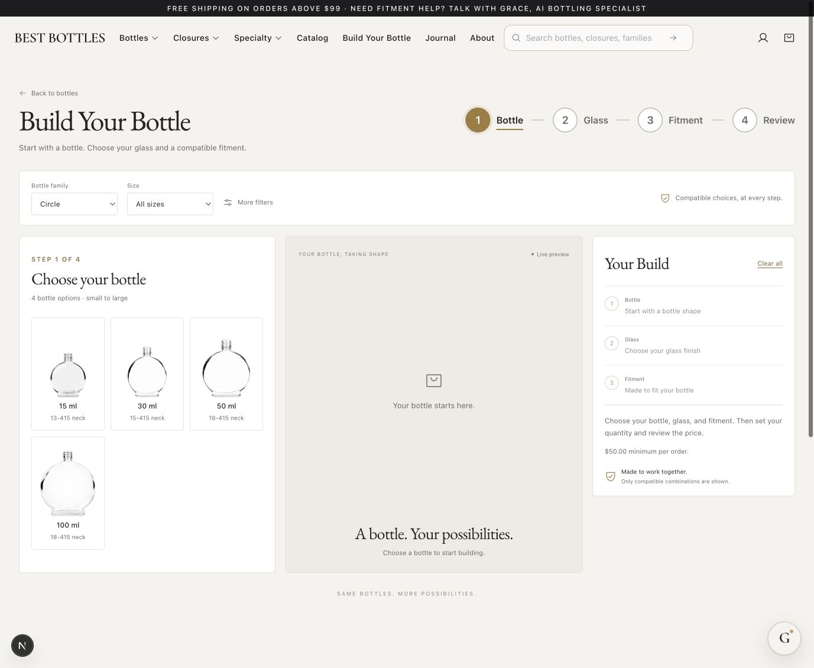
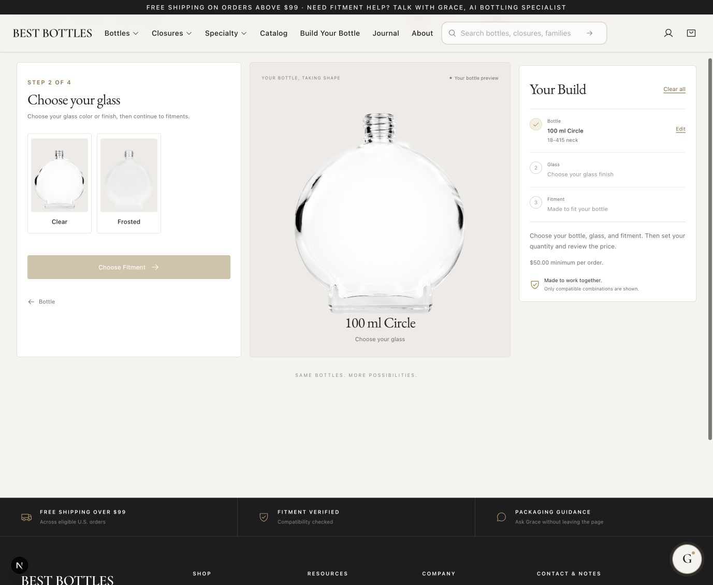
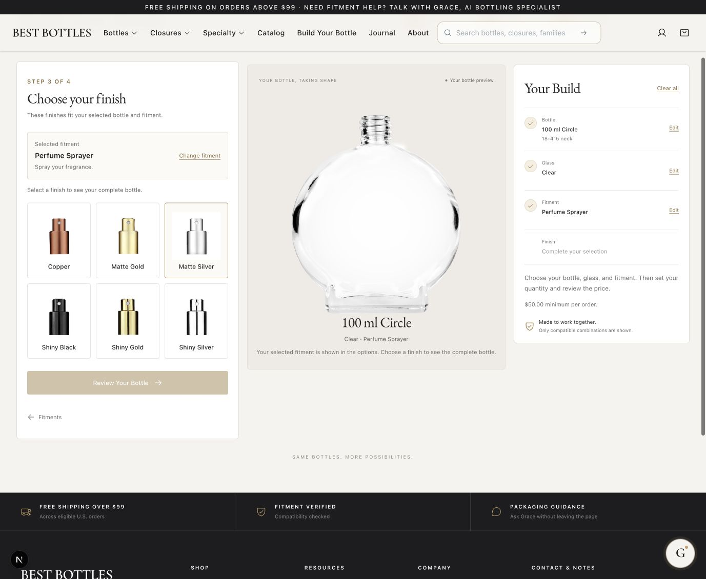
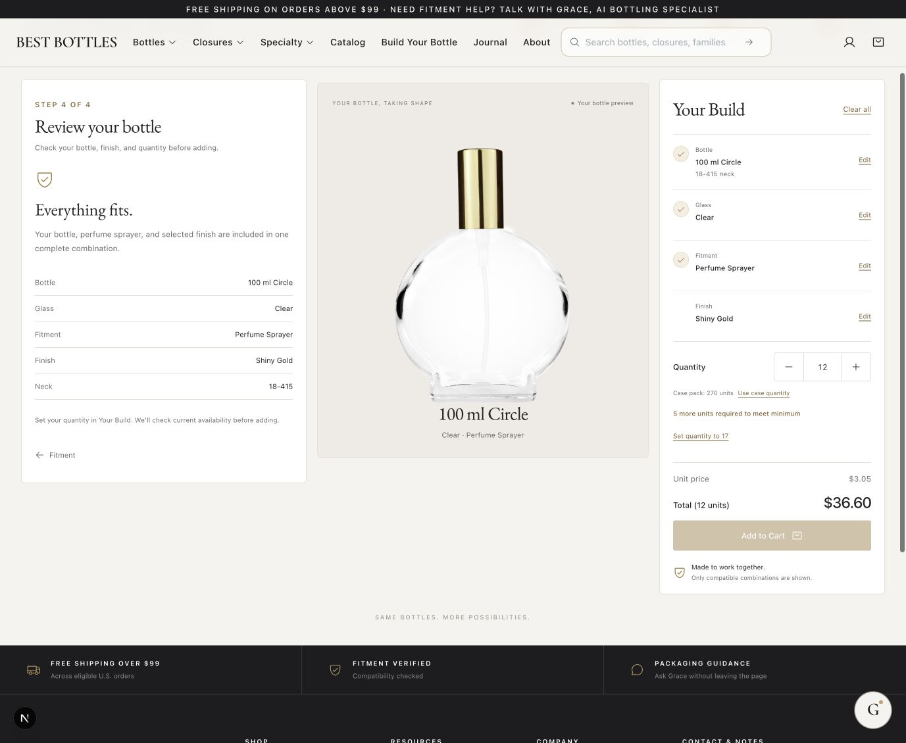
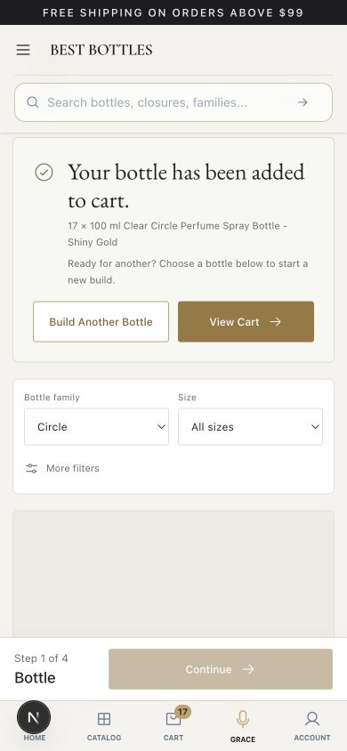
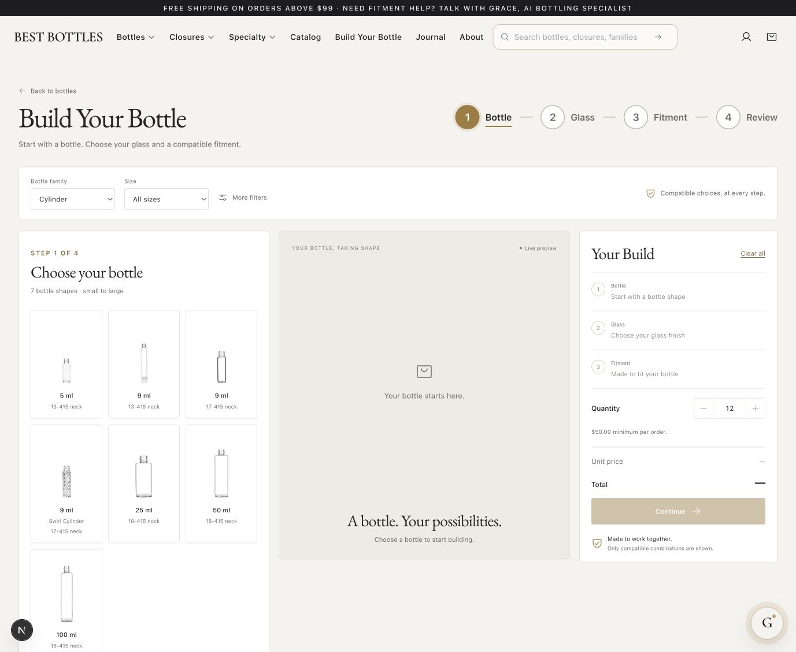
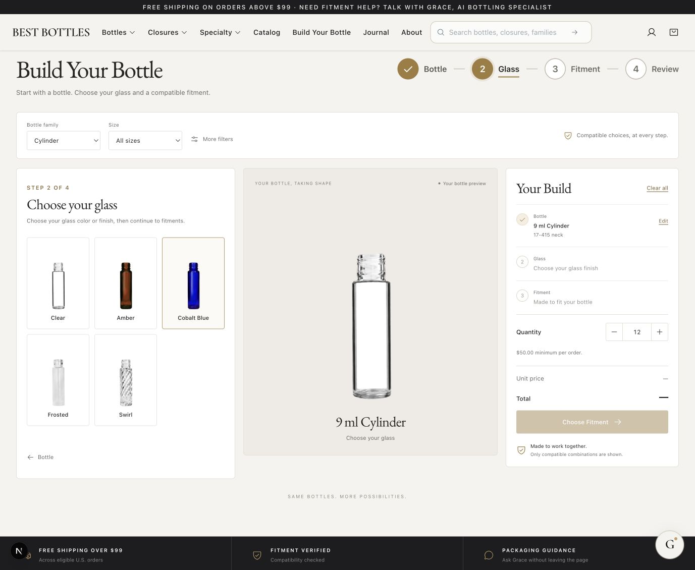
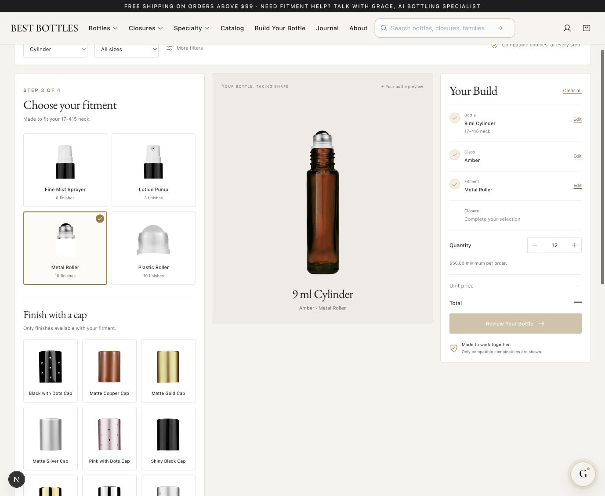
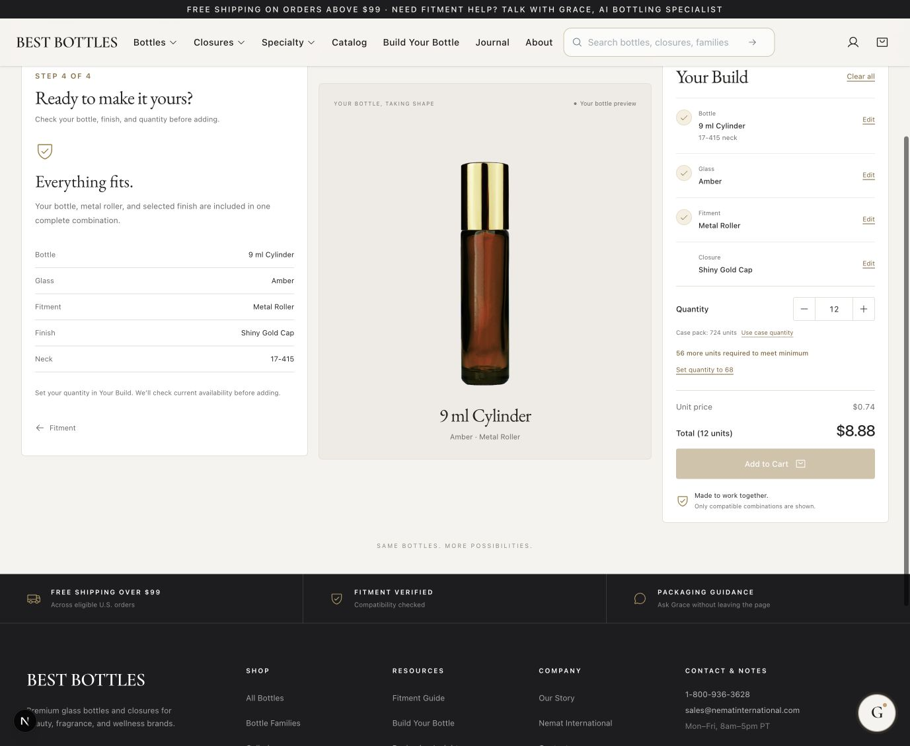
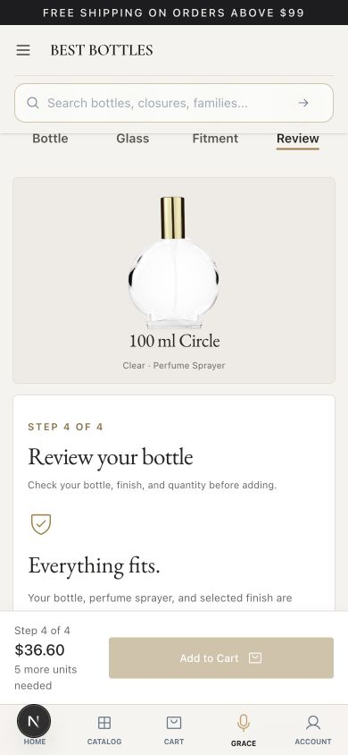

# Build Your Bottle flow review

Reviewed and improved locally on September 6, 2026. Preview: http://localhost:3001/matrix?family=Circle

The flow now presents one decision at a time: bottle, glass, fitment and its finish, then review. This report records the current browser walkthrough; it is not production acceptance or a complete accessibility audit.

1. **Bottle — working.** Family and size filters appear at the start. Circle shows four bare bodies (15, 30, 50, 100 ml); Cylinder shows six options, including the two distinct 9 ml necks. The unsupported decorative 30 ml Cylinder is absent. Redundant Swirl metadata no longer creates a duplicate body. Selecting a body clears previous glass/top choices. Retired assembled SKUs are excluded.

   

2. **Glass — clearer.** “Choose your glass” covers glass color and finish. A bone backdrop makes frosted glass visible. The next action sits directly below the choices. A sole glass option is selected automatically; the 30 ml Circle walkthrough advanced directly to fitment.

   

3. **Fitment and finish — simplified.** Fitment cards explain their use. Selecting a fitment replaces the full list with a compact selection and compatible cap/finish images. “Change fitment” returns to the type choices; this was exercised in the browser. The body stays bare until a complete configuration is selected. Finish eligibility continues to require an exact active compatible component and supported media.

   

4. **Review — working.** Quantity, minimum-order guidance and price appear when the bottle is complete. A 100 ml Clear Circle with a Shiny Gold perfume sprayer showed $3.05 each; 12 units correctly remained below the $50 minimum, while 17 units totaled $51.85 and enabled Add to Cart.

   

5. **Cart confirmation — working.** Adding the configuration created one cart line with the exact bottle, finish, quantity 17 and total $51.85. The builder reset to bare-bottle selection and offered Build Another Bottle or View Cart. The cart was empty before this test; the QA item was removed afterward and the empty cart was verified. No checkout or purchase was performed.

   

## Checks and limits

- Browser walkthrough covered Circle glass, fitment, finish, review, minimum quantity, add to cart, reset and changing fitment. Cylinder chooser was checked after deduplication.
- At 390 × 844, document width was 390 px: no horizontal overflow. Mobile review and confirmation were inspected; the desktop viewport was restored afterward.
- 45 focused tests passed across builder selection, cap previews and product compatibility. TypeScript, targeted ESLint and `git diff --check` passed.
- Focus moves to the current step heading, scrolling respects reduced motion, and compact action controls have larger touch targets. Screen-reader behavior, full keyboard coverage and measured text contrast still need a dedicated accessibility pass. Secondary text remains small and light in the captured desktop UI.
- This does not certify every catalog family or every source image. Circle and Cylinder are the currently eligible families; other families need verified body/component media before inclusion.
- Changes are local and uncommitted. No backend deployment, production deployment, PR update or merge was performed for this audit.

## Before-change evidence

The original walkthrough exposed premature quantity/blank prices, distant next actions, and a long fitment grid followed by another finish grid. The following screenshots were captured in this same review run:

Additional mobile review evidence:

