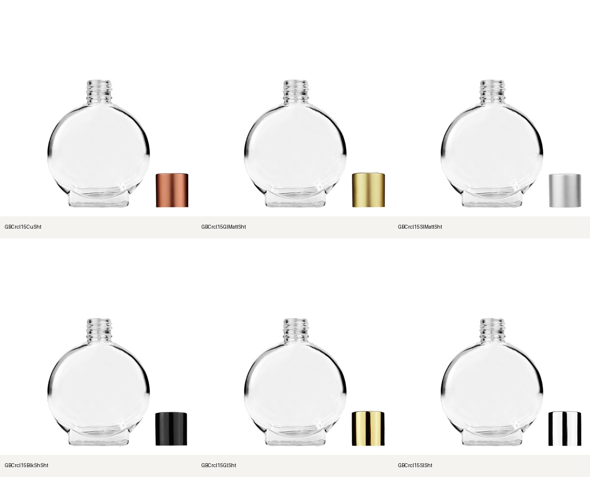

# Builder and PDP reconciliation — September 23, 2026 UTC

Current Convex product records are the first lookup. Where they leave a gap or
contradict one another, the exact product and component pages on bestbottles.com
are the catalog authority. Matching neck diameter alone never establishes a
compatible component. Desktop/client PSDs establish artwork identity and geometry.

## Implemented locally

- Builder listing and fresh purchase validation use the same current resolver.
  Eighteen previously listed choices failed purchase validation because their
  exact plate used a sibling's verified bare-body layer. Those choices now pass.
- Builder, PDP (`grace.getBottleComponents`), and product fitment queries hydrate
  components from the same current product record. Retired references recover
  only through a unique exact active website SKU. Ambiguous records, assembled
  products used as loose parts, and wrong-neck records are excluded.
- Added 25 exact component witnesses: nine frosted Circle tassels, nine
  Circle/Round droppers, one Round ivory/gold tassel, and six Circle short caps.
  These witnesses can restore the exact included component omitted by an older
  fitment rule; they do not expand that rule to sibling finishes or bottles.
- Added 12 exact complete-assembly witnesses: ten short shiny-black reducers
  and two Empire white rectangular pumps. They retain their assembled checkout
  identity and do not invent a loose component listing.
- Complete exact kits can make a new finish visible even when another finish
  provided its bare-body preview and the new finish has no standalone plate yet.
- Recovered six Circle 15 mL short-cap kits from exact Desktop cap-on/off PSDs.
  Native source pixels, uniform body/hardware transform, source parity and alpha
  checks pass. Cap-off exports place the cap beside the bottle.

No Shopify inventory, approved hero assets, remote component index, or deployment
was changed by this reconciliation. Source originals remain untouched.

## Verified results

| Family | Source configurations | Locally available | Held/excluded |
| --- | ---: | ---: | ---: |
| Circle | 220 | 219 | 1 |
| Cylinder | 436 | 416 | 20 |
| Empire | 91 | 91 | 0 |
| Round | 178 | 178 | 0 |
| Total | 925 | 904 | 21 |

These counts use 15 **local-only** Circle review kits: six new short caps and nine
previously extracted frosted tassels. Without those unpublished kits, the replay
before the final kit-loading correction exposed 889 choices. Counts describe
eligibility and media availability, not full visual approval of every assembly.

- All 925 records passed a real local Convex-query replay proving identical
  component identity, image, variant ID, sellability, and stock between Matrix
  and the PDP component query. All 49 source-link witnesses were also checked.
- 112 selected configurations passed HTTP 200 purchase validation against the
  current read-only backend through the new local frontend. All 15 local artwork
  configurations passed separately. No carts or orders were created.
- Browser verification on `http://localhost:3061/matrix?family=Circle` showed
  ten Circle 15 mL screw-cap finishes, both roller types, and nine frosted
  Circle 50 mL tassel finishes. Short matte-gold cap and gold tassel assemblies
  rendered with the matching component and transparent outer background.
- Full suite: 232 test files / 2,140 tests passed; two files / seven tests were
  skipped by the existing suite. TypeScript and `next build --webpack` passed.
  Targeted lint had no errors. Full workspace lint also scanned untracked local
  audit scripts and reported nine errors there; none of those scripts are in
  this PR. Existing unrelated warnings remain.

[Machine-readable counts, remaining SKUs, and validation receipts](verification.json).
The regression fixture contains 1,082 product records and 63 fitment rules;
its SHA256 is recorded there. The 49 supporting current legacy-page receipts and
gzip-compressed HTML are retained in this directory.

## September 23 closeout update

Jordan confirmed Empire and Round are verified. The new
[release closeout](RELEASE-CLOSEOUT.md) records guarded insertion/rollback support
for all 15 Circle pairs and the refreshed 36-row colored 9 mL artwork audit.
Circle preflights passed source and existing public-index checks but are not
publication clearance: the new backend check is unavailable and scoped publishing
credentials are absent. No remote writes were made.

## Remaining gates

- Publish the 15 Circle kits and their matching plates together, then deploy
  the frontend and Convex query changes. None of those writes has happened.
- The nine frosted tassels and six short caps have **no existing exact plate/kit
  index rows** in the preserved before-images. The publisher now supports explicit
  insertion with atomic pair publication and exact rollback. Both scoped dry-runs
  remain blocked on the new backend index check; deploy the aligned backend and
  rerun before applying. See `RELEASE-CLOSEOUT.md`.
- A full Vercel production-environment download was rejected by automatic
  approval review because it could expose unrelated production credentials.
  It was not executed. Use an approved scoped release/deployment mechanism;
  do not download the full environment as a workaround.
- `GBCrclFrst50RdcrIvyLthr` remains held: both catalog and legacy text say 18-400,
  while that page's component pictures identify 18-415. A source clarification is
  required before assigning a different neck or cap.
- Cylinder holds include the requested 3.3/4 mL and 16 mm jumbo-roller exclusions,
  three plastic flip-top records, the 5/5.5 mL source alias, two decorated 30 mL
  assemblies without sufficient bare-body proof, and two Swirl 9 mL white rollers.
  Exact SKUs are listed in `verification.json`; never count intentional exclusions
  as missing Builder products.
- The earlier 36 colored 9 mL tube/material reviews and other native kit gaps
  remain in [the component accounting](../four-family-component-accounting-2026-09-22/README.md).
  Existing plate fallback and sellability do not prove correct transparent tubes,
  consistent flat-plate scale, or every source-to-render fit. No claim of complete
  visual clearance or deployed customer-flow verification is made here.

## Repeat checks

```sh
npx vitest run tests/catalog-component-products.test.ts tests/bottle-builder*.test.ts tests/catalog-included-assemblies.test.ts tests/four-family-reconciliation.test.ts
npx tsc --noEmit
npx next build --webpack
```

Local artwork staging uses `scripts/paperdoll/local-kit-overlay.mjs` with
`circle15-short-caps` here and the nine frosted rows from
`../circle-component-recovery-2026-09-22/native-circle50`. Merge only those 15
rows into a local overlay and set `BUILDER_LOCAL_KITS` when starting Next.
That overlay is explicitly ignored on Vercel.


