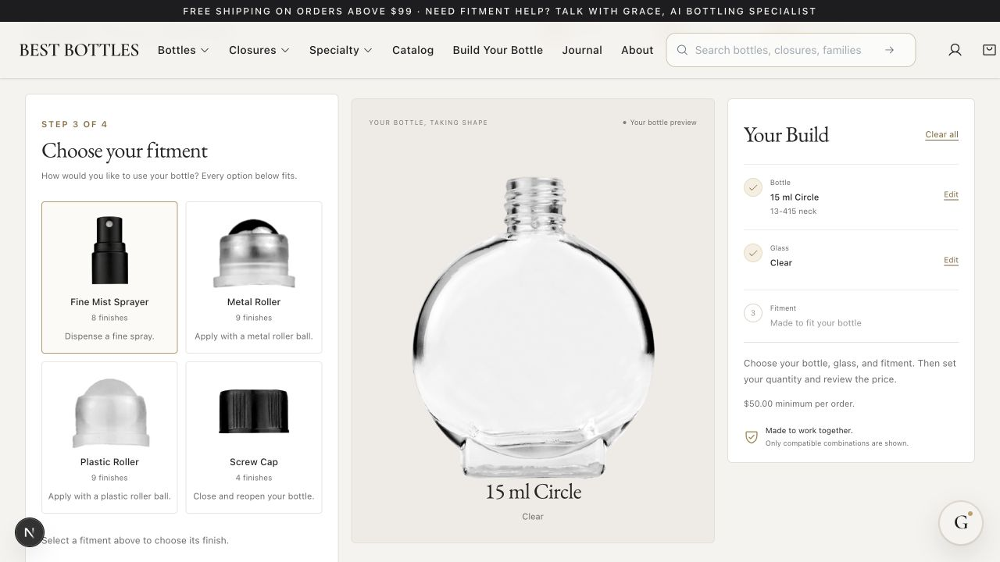
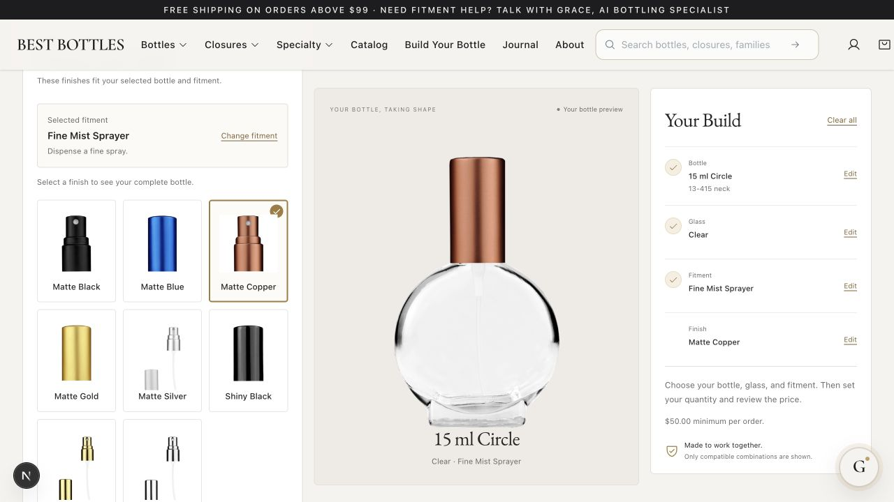

# Circle 15 ml fitment investigation

Read-only investigation, September 6, 2026. No application code, catalog records or media changed in this investigation.

## Conclusion

Fine-mist spray is a real Circle 15 ml configuration. The builder hides it because compatibility references point to retired duplicates and its reviewed media registry is incomplete. The three options currently visible are the configurations that survive those implementation filters, not a complete statement of physical compatibility.

## Current evidence

The live `matrix.getFamilyRows({family: "Circle", diagnostics: true})` response contains 30 Circle 15 ml assemblies: 9 plastic roller, 9 metal roller, 8 fine-mist spray and 4 cap-only. All use 13-415. There is no 15 ml reducer assembly or reducer component list in this response. Circle reducer assemblies occur at 50 and 100 ml.

Each 15 ml row uses bottle-listed compatibility, with no matched fitment rule. These lists contain caps, roll-on caps and sprayers. They must not be interpreted as a complete engineering fit test.

### Why all eight sprays disappear

Seven finishes reference retired `CMP-SPR-*` component IDs. `compatibleFinishComponent` rejects them because their website SKUs contain `__RETIRED__` and their sellability is false. Exact website-SKU lookup returns a different, non-retired product for each of those seven components. These replacements have `Fine Mist Sprayer` applicators, 13-415 necks and Shopify variant IDs. Their family and generic names still say Cap/Closure, although the group is fine-mist-sprayer-13-415.

Matte copper is the eighth finish. Its component passes compatibility filtering, but `GBCrcl15SpryCuMatt` has no published kit and no reviewed local assembly asset. The source review records `Non-pixel source needs review`. The local assembly registry currently contains none of the eight Circle 15 ml spray SKUs. Fixing the seven references alone therefore does not finish the work: their source media also needs review and inclusion.

| Component website SKU | Exact current Grace SKU | Circle reference |
|---|---|---|
| `CP13-415SpryCuMt` | `CMP-SPR-MTCP-13-415-07` | Current |
| `CP13-415SpryBlkSh` | `CMP-CAP-BLK-13-415-02` | Retired duplicate |
| `CP13-415SpryBluMt` | `CMP-CAP-13-415` | Retired duplicate |
| `CP13-415SpryGlSh` | `CMP-CAP-SGLD-13-415-03` | Retired duplicate |
| `CP13-415SpryGlMt` | `CMP-CAP-SGLD-13-415-02` | Retired duplicate |
| `CP13-415SprySlMt` | `CMP-CAP-SLV-13-415-02` | Retired duplicate |
| `CP13-415SprySlSh` | `CMP-CAP-SLV-13-415-03` | Retired duplicate |
| `CP13-415SpryBlkMt` | `CMP-CAP-BLK-13-415-01` | Retired duplicate |

### Why the roller cards show the same cap

`MatrixClient.tsx:204-206` tries to render the mechanism layer from a kit, then falls back to `BuilderFinishImage`. Live kit lookups for `GBCrcl15RollBlkDot` and `GBCrcl15MtlRollBlkDot` return null. `BuilderFinishImage` intentionally renders the outer closure. Both configurations use the same black dotted cap, so they display identical cap images under different roller labels. The cap image is appropriate for the finish selection, but not the roller-material decision.

### Screw cap and reducer are different questions

The legacy catalog confirms a cap-only Circle 15 ml product, so Screw Cap is a legitimate option. The current evidence does not confirm a 15 ml reducer. Search results mentioning all Circle family sizes often describe a 50 or 100 ml reducer product; those are not evidence for a 15 ml reducer. A specific compatible insert/assembly must be identified before enabling it.

## Recommended correction

1. Resolve the seven stale component references to the exact active website-SKU records, preserving the original bottle-listed compatibility evidence. Do not bypass retirement checks or broadly enable every component with the same thread.
2. Review and register the eight exact Circle spray assemblies; inspect the grouped copper source rather than inventing or stretching an image.
3. Use actual metal/plastic roller images at fitment selection. Keep cap photos for the subsequent finish selection.
4. Keep Fine-mist sprayer, Metal roller, Plastic roller and Screw cap as the supported fitment choices once their data and media are complete. Reducer stays unconfirmed pending a specific source-backed match. Roller ball is the general mechanism; metal and plastic are its variants, not three separate mechanisms.
5. Make the next action describe the current decision: choose a fitment, then choose its finish, then review. The disabled Review Your Bottle button on the fitment-type screen is premature and should be deferred or relabeled.
6. Add regression coverage for active replacements of retired component aliases and separate missing-media diagnostics from compatibility failures. Verify every spray finish through exact-assembly cart preflight before declaring the repair complete.

## Sources

- [Circle 15 ml matte-black fine-mist spray](https://www.bestbottles.com/product/circle-design-15-ml-bottle-matte-black-spray): exact assembly `GBCrcl15SpryBlkMatt`, 13-415.
- [Matte-black 13-415 sprayer component](https://www.bestbottles.com/product/spray-top-matte-black-13-415): exact component `CP13-415SpryBlkMt`.
- [Circle 15 ml plastic roller](https://www.bestbottles.com/product/circle-design-15-ml-bottle-plastic-roller-ball-plug-black-shiny-cap-with-dots).
- [Circle 15 ml metal roller](https://www.bestbottles.com/product/circle-design-15-ml-bottle-metal-roller-ball-plug-black-shiny-cap-with-dots).
- [Circle 15 ml short black cap](https://www.bestbottles.com/product/circle-design-15-ml-bottle-short-black-cap).
- Live Convex read-only calls: `matrix.getFamilyRows`, `products.lookupSku`, `productKits.forSku`.
- Local sources: `src/lib/bottle-builder/model.ts`, `src/components/matrix/MatrixClient.tsx`, `src/components/bottle-builder/BuilderFinishImage.tsx`, `convex/matrix.ts`, `data/paper-doll/circle-builder-assembly-review.json`.

The generic product-truth audit matched the exact spray assembly and reported no issues; it does not inspect the nested builder component joins or media eligibility, so that result does not negate these findings. No checkout transaction or backend mutation was performed.

## Implemented locally after approval

- Added `src/lib/bottle-builder/components.ts`: bounded exact website-SKU lookup for retired aliases already present in a bottle's compatibility list. The alias must contain the listed Grace SKU; the replacement must have the same website SKU and neck, a different current Grace SKU, a Shopify variant, and no explicit unavailability. Both builder loading and fresh cart validation use this path. Stored shared-backend records were not mutated.
- Registered all eight Circle 15 ml spray assemblies and three actual mechanism photographs using `scripts/paperdoll/build_circle15_fitment_media.py`. Original source positions/geometry are retained. The copper cap's external white retouch patch and metal roller's white polygon are excluded. Faint paint residue below the plastic plug is cropped away. Source hashes and part assignments are recorded in the media review JSONs.
- The fitment screen now shows Fine Mist Sprayer, Metal Roller, Plastic Roller, and Screw Cap. No 15 ml reducer is introduced. Cap/finish photos remain in the subsequent chooser.
- Removed the premature Review button from fitment-type selection. The instruction now asks the shopper to choose a fitment, and Review appears in the finish chooser.
- Added diagnostic categories for unresolved compatibility, unavailable catalog records, and missing reviewed media.
- Verification: 57 focused tests passed; TypeScript, targeted ESLint and diff whitespace checks passed. All eight spray variants passed the real local read-only cart preflight with exact assembly and component IDs (see `circle15-preflight-results.json`). The copper selection was exercised through Review in the browser. At 390 px, document width remained 390 px. Temporary viewport and test tab were cleaned up. No cart item or purchase was created in this repair run.

