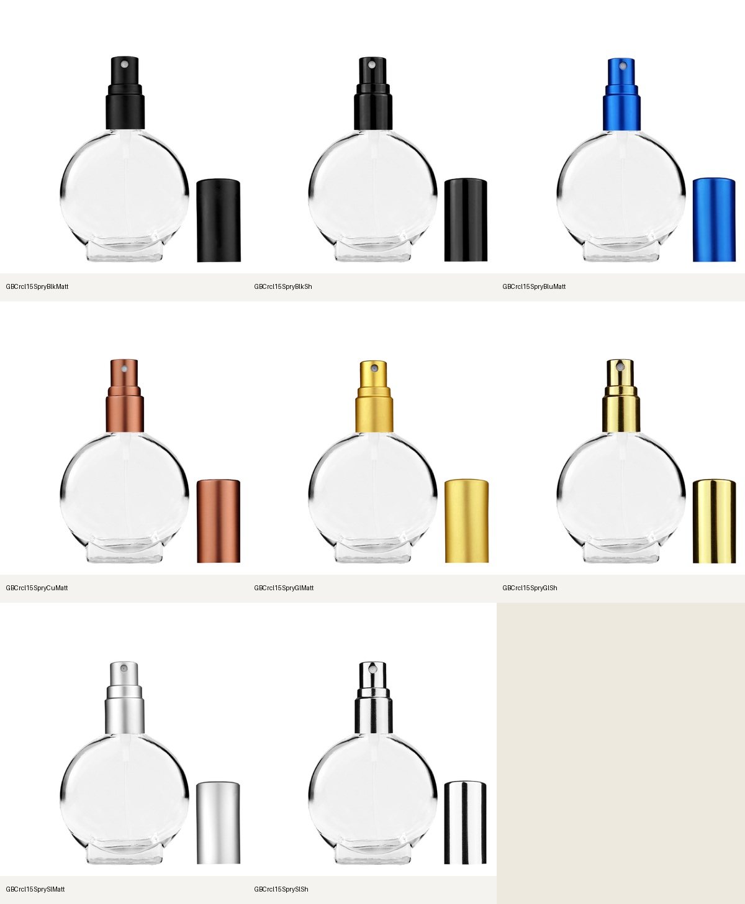

# Circle component recovery and fixed-body pilot

## Release update

Twenty-nine Circle kits from this recovery were published with their matching cap-on/off plates to the shared staging backend on September 22. Nine frosted Circle 50 mL tassel candidates remain held. See [the scoped release receipt](../component-release-2026-09-22/README.md) for the 47-SKU Cylinder/Circle release, rollback snapshots, and hosted verification. The historical preparation notes below describe the earlier local-only state.

## Original preparation state

- The previously deployed `repairFourFamilyComponents:run` mutation was applied
  to `precise-raccoon-123`: nine reversed Circle kit roles, 26 tassel product
  assignments, and two new tassel groups. Its guarded before-image receipt is
  retained in local `output/cylinder-fitment-repair/four-family-live-apply-receipt.json`.
- The shared website's 50 mL clear Circle / Matte Silver tassel configuration
  was visually checked after the repair. It shows one bottle with the actual
  tassel sprayer and the correct thumbnail, replacing the doubled bottle.
- Thirty-eight recovered Circle kits (eight 15 mL, thirty 50 mL) remain **local review candidates**.
  No new kit bytes, kit index, plates, or heroes were published in this follow-up.
- The single Sunburst glass-body experiment is **not approved or integrated**.
  It does not replace any approved hero or recovered component kit.

## Eight exact source kits

The capped/uncapped master pairs are under `BB-PSD-Files-Master/5.  13-415
Bottles/17. Circle 15ml`. `circle15-recipes.json` records source hashes, exact
layer assignments, the catalog identity, and one uniform transform per assembly.

| Finish | Website SKU |
| --- | --- |
| Matte Black | GBCrcl15SpryBlkMatt |
| Shiny Black | GBCrcl15SpryBlkSh |
| Matte Blue | GBCrcl15SpryBluMatt |
| Matte Copper | GBCrcl15SpryCuMatt |
| Matte Gold | GBCrcl15SpryGlMatt |
| Shiny Gold | GBCrcl15SpryGlSh |
| Matte Silver | GBCrcl15SprySlMatt |
| Shiny Silver | GBCrcl15SprySlSh |

Each has the native body, dip tube, exposed sprayer, and matching overcap. The
body pixels match between each capped and uncapped source. All eight passed
source-composite parity and alpha/canvas checks, including the cap-off sidecar
inside the frame. The copper master has an external white cleanup polygon;
its reviewed exclusion is guarded against removing any nonwhite product pixels.



The component working canvas is 1000 × 1100, uniformly registered from the PSD.
This is separate from the approved 2080 × 2288 hero export canvas. These are
source components, not regenerated hero images.

## Thirty 50 mL source kits

`circle50-recipes.json` and `native-circle50/kits/manifest.json` preserve the
exact PSDs, source hashes, layer assignments and reconstruction checks for:

- Twelve perfume-spray kits: six clear and six frosted, with native dip tubes,
  exposed sprayers and matching removable overcaps.
- Eighteen tassel kits: nine clear and nine frosted. Each bulb, hose and tassel
  stays together as one sprayer assembly.

All thirty passed source-composite parity and alpha/canvas checks. Seven
capped/uncapped source pairs have slight native retouch differences; the body
dimensions match, alpha intersection-over-union is at least 0.9970, and mean
pixel difference is at most 1.18/255. `circle50-body-pairs.jpg` records their
visual comparison. The extractor verifies the recorded source hashes and
bounded differences, retaining the capped master's body pixels unchanged.

The live catalog currently resolves twelve sprays and nine clear tassels for
Builder. Nine frosted tassel rows have unresolved component compatibility;
their artwork is prepared without adding invented Builder configurations.

`circle50-framing.json` records 126 eligible Builder views and 60 PDP cap states:
zero clipped assemblies, zero body-width spread and zero baseline spread across
eligible Builder finishes and stages. The gold and ivory-silver clear tassel
previews were also checked in the actual local Builder: identical body image,
transform and SVG viewBox, with no opaque white rectangle. The frosted copper
spray shows its matching copper sidecar and exposed sprayer/dip tube.

## Local review shared by Builder and PDP

`src/lib/paper-doll/local-component-kits.ts` serves the same staged exact-SKU
kits to both consumers. PDP additionally requires `assetPreview=kits` on an
exact loopback hostname, and the reader is disabled on Vercel. Finish changes
preserve the review flag. Candidate artwork does not silently become public.
An exact-SKU review marker selects recovered components in Photo mode on both
desktop and mobile, including the expanded viewer. Without the review marker,
published cap-on/off photographs retain their normal priority.

Stage the checked-in recovery with:

```sh
node scripts/paperdoll/local-kit-overlay.mjs \
  --batch docs/reviews/circle-component-recovery-2026-09-22/native-circle15 \
  --name circle15-recovered-2026-09-22
```

Stage `native-circle50` with the same command and the name
`circle50-recovered-2026-09-22`. The current local session combines all 38 Circle
kits with the nine previously recovered clear Cylinder 9 mL kits in
`public/local-kits/component-review-2026-09-22.json`.

- Builder: `http://localhost:3059/matrix?family=Circle`
- PDP: `http://localhost:3059/products/circle-15ml-clear-13-415-finemist?assetPreview=kits`
- 50 mL frosted PDP: `http://localhost:3059/products/circle-50ml-frosted-18-415-perfumespray?assetPreview=kits`
- Source/pilot comparison: `http://localhost:3059/local-kits/circle15-review/index.html`

The 15 mL matte-gold Builder cap-off and cap-on states were visually checked:
the exposed pump, dip tube and sidecar are present; the cap seats over the pump
without exposing the neck threads.
The desktop PDP was verified against the actual `/local-kits/` part URLs:
15 mL matte gold in both cap states retains the same frame transform, and
50 mL frosted copper shows its exposed pump, tube and matching sidecar.
Mobile uses the same exact-SKU override; a separate mobile browser check is
still pending (the in-app viewport override did not change its 1280px viewport).

## Cylinder chooser scope

Per the user's request, Builder excludes Cylinder 3.3 mL, 4 mL, 28 mL/16mm,
and 50 mL/16mm. The same builder candidate predicate excludes them from fresh
configuration resolution. Catalog and PDP access remain intact. The local
chooser was checked and retains six options: 5 mL/13-415, Tall 9 mL/13-415,
standard 9 mL/17-415, 25 mL/18-415, 50 mL/18-415, and 100 mL/18-415.

## Sunburst pilot lineage and remaining gates

One successful `gpt-image-2.5-sunburst` API output was generated natively at
2080 × 2288 using the exact Circle body and the approved clear-glass reference.
The input has a 91% glass-foot baseline. The original result, prompt, reference,
source alpha, registration and request receipt are preserved under ignored
`output/imagegen/circle15-fixed-body-pilot/`.

Output SHA256:
`280be71a1f178cd58846b4454ca812cdea29cd5d12f1e067d5bf8d3442e014b3`.

The comparison offers a source-outline and baseline overlay. This is a visual
comparison aid, not proof of exact geometry. Optical edge samples are retained;
the generated foot and transparency still require clearance before reusable
hardware registration. Review the material first, then prove one complete
assembly in both cap states before extending the generated-body approach.

## CI correction and remaining release work

PR #230's Vercel failure was a runtime import from the deploy-excluded `docs/`
directory. The stock reconciliation payload now lives in `convex/cylinder-stock-reconciliation.json`, with
the runtime and test imports updated. This does not apply the pending stock
proposal; all 45 disputed availability changes remain unapplied.

Latest local validation: 2,075 tests passed, seven skipped; TypeScript,
changed-file lint, and the Webpack production build passed. A DOM regression
test confirms that local component review overrides existing flat photographs
in both cap states, keeps the frame fixed, and cannot opt a different SKU in.

The remaining Cylinder artwork described in the preceding recovery ledger is
still outstanding. Source-kit publication, aligned frontend/backend deployment,
and deployed PDP/Builder checks remain release gates. Do not declare the four
families complete from a local sheet or a merged PR.
