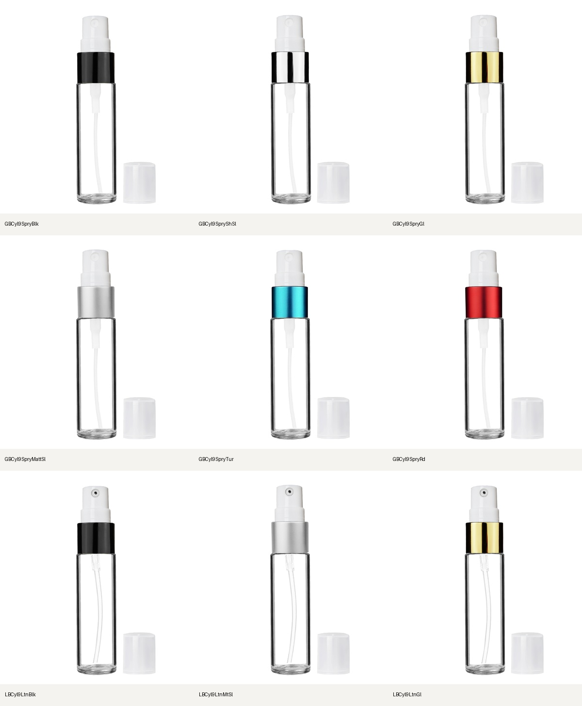
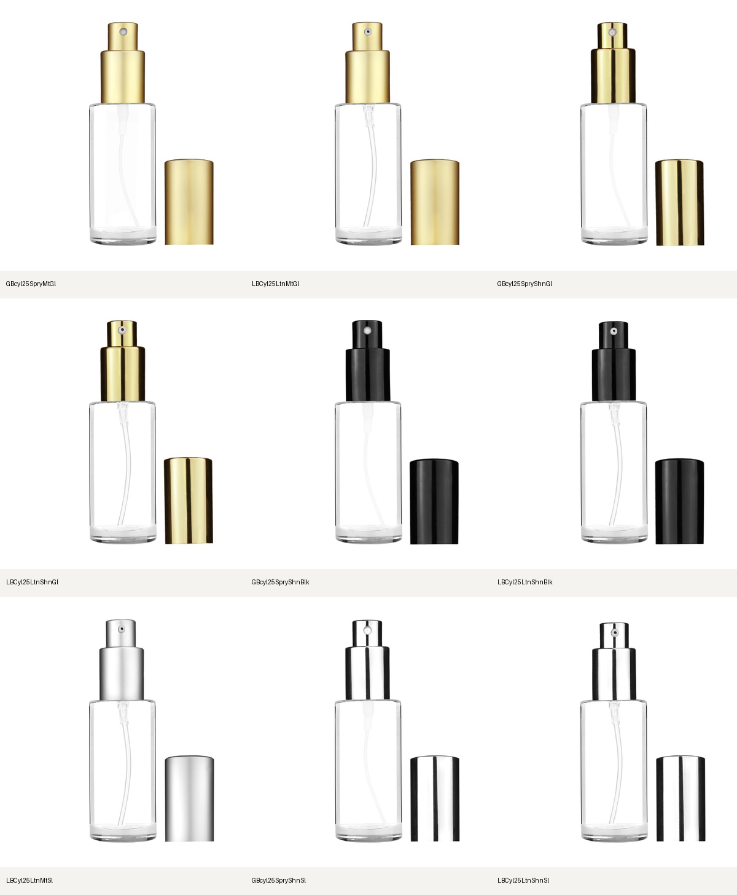

# Cylinder catalog components and source artwork

Release update: the 18 recovered Cylinder kit/plate pairs are now published to the shared staging backend. See [the scoped release receipt](../component-release-2026-09-22/README.md). PR #230 is merged. The original audit/preparation snapshot below remains historical; its remaining artwork and stock conflicts are tracked in the follow-up four-family ledger.

The later [Circle follow-up](../circle-component-recovery-2026-09-22/README.md)
records the separately applied nine-kit/26-product Circle repair and the four
requested Cylinder Builder exclusions. Counts below are the original audit
snapshot, before those chooser exclusions; they remain relevant to PDP artwork.

## Compatibility correction

All 436 current Cylinder catalog rows were assessed. There are 432 supported
glass configurations, three standalone plastic flip-top products, and one
unresolved imported 5.5 mL alias (`GBCyl5SpryBlkMatt`). This is an audit of the
current catalog snapshot, not a claim that every legacy product page has been
freshly reconciled. Exact source pages were checked for the disputed components,
closed assemblies, short caps, and availability records.

Builder (`matrix.getFamilyRows`), PDP (`products.getCompatibleFitments`) and
Grace now share `catalogComponentSources.ts`. Missing relationships are recovered
only from catalog siblings of the same Cylinder glass body: capacity, glass,
neck/interface and compatible shape. Thread equality alone never adds a part.
Existing fitment and occupied-neck rules still filter the result. New catalog
sibling relationships are read on subsequent queries without a UI option list edit.

- The 25 mL catalog had 38 assemblies without component lists. Seven lotion
  assemblies carried the recorded body relationships used to repair them.
- The standard 50 mL 18-415 body stays distinct from the 50 mL 16mm jumbo roller.
  Likewise, standard 9 mL 17-415 and Tall 9 mL 13-415 remain distinct bodies.
- Eighteen new exact short-cap source links supplement the six existing ones.
  Backend and frontend now read the same 24-link source file.
- Seventeen exact complete assemblies have source-backed included hardware.
  They retain their own SKU/checkout identity and do not invent separately sold
  components or compatibility with other bottles.
- Native PSD pump seating remains native. The previous generic lift exposed
  glass threads and made the 25 mL mechanism float.
- An overcap no longer inherits the collar's color label in Builder. A black
  pump collar can have a clear overcap.

## Counts and outstanding work

[`coverage.csv`](coverage.csv) records all 436 variants. Its structural readiness
column is a strict configuration/kit audit, not a deployed UI count or visual
approval. Candidate eligibility, stock conflicts, and artwork are separate.

| Check | Count | Meaning |
| --- | ---: | --- |
| Strict structurally complete with current stock | 372 | Proposed local code, current hosted kits |
| Additional configurations blocked by disputed stock labels | 45 | Reconciliation proposed, not applied |
| Strict structurally complete after that simulated stock correction | 417 | Simulation only |
| Missing/invalid full kit configurations | 15 | Includes 11 plastic rollers, shiny-silver 9 mL spray, 3.3 mL black, and two decorated 30 mL assemblies |
| Existing standard 9 mL spray/lotion kits missing dip tubes | 44 | Semantic defect despite a structural “full” label |
| Existing 25 mL kits missing exposed pump/sprayer | 9 | Contain body, dip tube and overcap only |

The artwork issues above affect 68 distinct configurations. Eighteen now have
recovered complete local kit candidates (nine clear 9 mL and nine 25 mL). Ten
additional plastic-roller candidates were inspected as an initial source study;
one cobalt/pink plastic roller still requires combining its exact uncapped
roller with its capped source body. Those roller studies are not release kits.

After the 18 recovered kits are published, artwork work remains on 36 colored
standard 9 mL spray/lotion configurations and 14 other kit gaps. A shared neck
or similar photo is not sufficient to silently transplant a different bottle's
hardware. Keep these in the per-SKU ledger until source and visual checks pass.

## Recovered source sheets

### Clear 9 mL: six sprays and three treatment pumps

The Desktop PSDs under `Desktop/Best Bottles/17-415 Bottles` include dip tubes
that are absent from the project master copies. The spray tube is milky; the
treatment-pump tube is thin and clearer. The correct photographed nozzle repair
is retained with the pump. No AI generation or hero-image replacement was used.



### 25 mL: exposed mechanisms

These use capped/uncapped source pairs in the master `Cylindrical 25ml` folder.
Historical PSD filenames say 30 mL; this is a documented source crosswalk and
does not refer to the decorated gold/silver 30 mL products.



The recipe files retain exact source hashes and physical layer assignments.
Each kit validates paired body pixels, uniform registration, transparent canvas
edges, and source-composite parity (mean error <= 6/255 and <= 1% ink pixels
over 40/255). One 25 mL pair differs only in fully transparent RGB pixels; the
extractor verifies identical alpha and every visible pixel before accepting it.
The transparent 9 mL overcaps retain the source's 201/255 opacity. All exports
here are 1000 x 1100 PDP component canvases, separate from approved 2080 x 2288
hero exports and their 91% baseline.

Reproduce from this worktree with its PSD-capable Python environment:

```sh
../catalog-hero-release/.hero-tools-venv/bin/python scripts/paperdoll/recover_cylinder_source_kits.py \
  --recipes docs/reviews/cylinder-component-coverage-2026-09-22/desktop-nine-recipes.json \
  --catalog output/cylinder-fitment-repair/fresh-inventory.json \
  --out output/cylinder-fitment-repair/desktop-nine-recovered
```

For the 25 mL batch, use `native25-recipes.json` and `native25-recovered`.
Archived manifests and referenced content-addressed part files accompany these
sheets, so the recovery does not depend on ignored scratch output alone.

## Validation and release boundary

Local Builder at `http://localhost:3059/matrix?family=Cylinder` was checked with
`BUILDER_LOCAL_KITS=public/local-kits/cylinder-nine-desktop-2026-09-22/kits.json`.
The clear 9 mL treatment pump displayed its dip tube, exposed actuator, sidecar
overcap and cap-on view without changing the bottle's framing. The 25 mL native
pump seating correction was also visually checked. The server returned/rendered
the actual Builder page. It still queries the old live backend for catalog data;
the newly shared backend relationship logic is covered by Convex integration
tests and local replay, not a production deployment claim.

PR #229 is already merged; its final CI, intent-eval and Vercel checks succeeded.
This work is on the separate `codex/cylinder-pdp-fitments-2026-09-22` branch.

Final local checks: 2,072 tests passed (seven skipped across two files), full
TypeScript and Webpack production build passed, and repository lint completed
with zero errors and 97 warnings. The shared resolver test was updated
to follow normalization through the new catalog helper. A PDP DOM test timed
out during the first concurrent build/test run; the final complete test run
passed after the build finished. Eighteen recovered source kits passed their
alpha/canvas, body-pair, and composite-parity gates.

Before declaring the Cylinder cleanup complete:

1. Review and publish recovered kits/plates with exact source lineage. The
   existing publisher's master-only path assumptions need an explicit adapter
   for the Desktop source; never disguise it as a project-master file.
2. Finish the remaining artwork cases and check material fidelity across the
   36 colored 9 mL mechanisms. Preserve the approved hero release throughout.
3. Resolve the pending 45-row stock-label question. The proposed internal
   mutation is dry-run by default and is never applied merely by deploying it.
   It does not change Shopify inventory, prices or variant IDs.
4. Deploy an aligned backend and frontend, then verify exact options and artwork
   in both PDP and Builder, including both 50 mL bodies. Preserve SKU-scoped
   index rollback receipts before asset publication.

No unrelated root-worktree changes were included.
