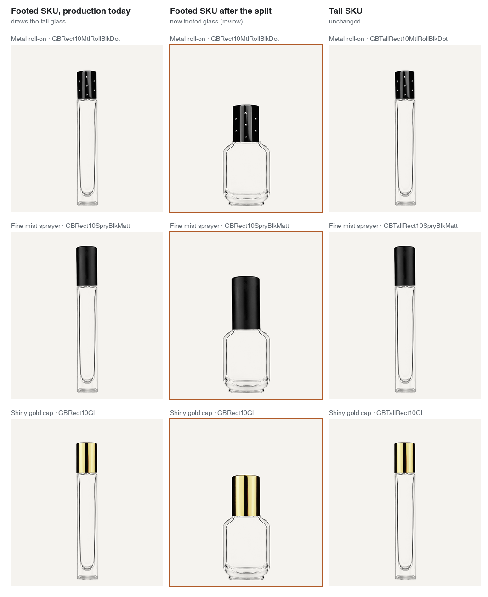
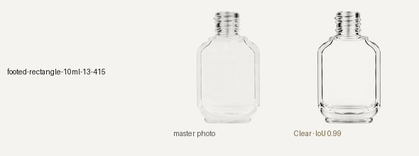

# Footed Rectangle 10 mL, 28 Sep 2026

All 30 live Footed Rectangle 10 mL SKUs (`GBRect10…`) drew the Tall Rectangle 10 mL glass. The library filed both shapes as one body (`rectangle-10ml-13-415`: same family, capacity and neck), and its only glass image was the tall one (`16. Tall Rectangular 10ml`). Production already files them on separate pages (`footed-rectangle-10ml-…`, `tall-rectangle-10ml-…`), so the library now splits a body by its pages wherever the pages disagree. That happens only here; every other body and glass image keeps its name.

- `footed-rectangle-10ml-13-415`: 38 rows, 50 mm tall, 29 x 19 mm.
  - New glass image: cut from `5. 13-415 Bottles/18. Footed Rectangluar 10ml/1. Footed Rect 10ml (Uncapped) PSD/1. GBRect10BlkSht.psd` (layer 4, white fill stripped as on the tall one).
  - Rendered through the lit reference-glass pass like the other 107 images: fitted IoU 0.989, width 29.46 mm against 29 mm (1.6%), height and width scales within 1.5%, status ok. Render cost $0.08.
- `tall-rectangle-10ml-13-415`: 36 rows, 101 mm tall, 17 x 17 mm. It keeps the existing tall image, re-keyed and pixel-identical.

