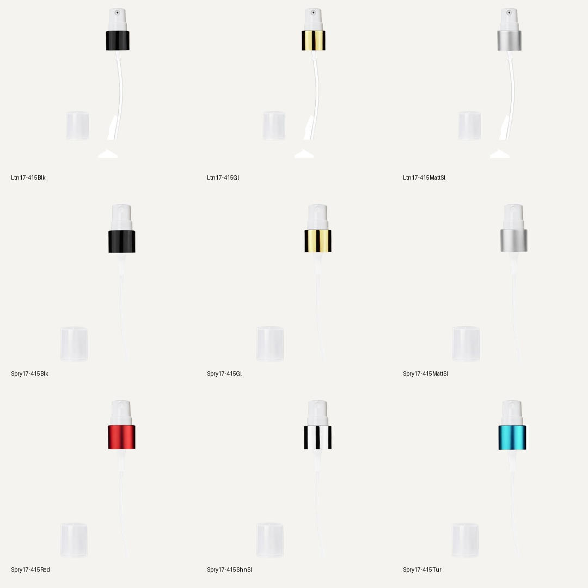

# Four-family component accounting

Read-only catalog and framing snapshots from September 22, 2026 PDT, after the
[47-pair component release](../component-release-2026-09-22/README.md).
Backend: `https://precise-raccoon-123.convex.cloud`; storefront:
https://best-bottles-website.vercel.app.

## What is accounted for

| Family | Catalog configurations | Builder-visible | Replayed layered states | Clipped states |
| --- | ---: | ---: | ---: | ---: |
| Cylinder | 436 | 362 | 2,172 | 0 |
| Circle | 220 | 180 | 882 | 0 |
| Round | 178 | 128 | 768 | 0 |
| Empire | 91 | 85 | 510 | 0 |
| Total | 925 | 755 | 4,332 | 0 |

Every catalog configuration has a row in [component-fit-ledger.csv](component-fit-ledger.csv).
The test replays body, fitment and complete stages with cap-on/off through the
actual Builder layout functions. All 14 body groups have stable glass width/base
within the audit tolerance, no sidecar overlap and no measured-ground mismatch.
Photo-only configurations do not produce layered states. This is not a claim
that every cap seats correctly, that every visible part is the right SKU, or that
PDP flat plates have been normalized. Those require exact source and visual review.

All 108 referenced product records resolve. The stricter category check found
106 component records and two stale references to complete plastic bottles:
`PB1ozSpryNat` and `PB1ozSprySl`. These are not loose sprayers. Existing Builder
SKU-pattern and PDP plastic-bottle guards exclude them from glass fitment choices.
Their old imported relationship entries remain a data-cleanup item; do not source
replacement hardware from these entire-bottle images. See
[component-reconciliation.json](component-reconciliation.json).

## Desktop and client-master sources

User direction: fetch needed components from Desktop Best Bottles master folders;
the client master is also allowed. Original artwork remains untouched.

- Desktop: `/Users/jordanrichter/Desktop/Best Bottles` (1,399 artwork filenames).
- Client: `/Users/jordanrichter/Projects/Clients/Nemat-International/BB-PSD-Files-Master`
  (6,069 artwork filenames).
- [Source candidates](source-candidates.csv): 107/108 reference rows and 870/925
  assembly rows have direct or explicit alternate filename candidates. 22 reference
  rows and 39 assembly rows have Desktop candidates. These counts include the
  stale plastic-bottle references and do not constitute component approval.
- An unmatched filename means source matching pending, not missing artwork.
  Inspect alternate names, embedded layers and exact legacy media before deciding.
- Nine native 17-415 mechanisms were extracted from Desktop's
  `Caps and Sprayers Missing Images/17-415 Lotion & Sprayers` folder: six sprays,
  three lotion pumps, each with dip tube and overcap. Their source/part hashes and
  legacy crosswalks are in [the manifest](desktop-17-415-hardware/manifest.json).
  **Not integrated or published.** Three lotion tube layers contain white cleanup
  scraps, and the 578 × 1046 source canvas may be lower resolution than exact
  full-assembly layers. Preserve source geometry and verify transmission through
  amber, cobalt, frosted and swirl glass before reuse.



## Applied identity repair

`CP13-415BlkShShtMtl` resolved to an existing record whose website SKU was blank.
The exact legacy page, existing Grace SKU `CMP-CAP-SBLK-13-415`, product URL and
Shopify variant established the match. Only `websiteSku` was populated; no
price, inventory, checkout ID or source artwork changed. The
[receipt](short-black-cap-repair.json) preserves the before-image and reversal.
The exact HTML bytes are retained gzip-compressed in `source-html/`; each filename
is the SHA256 of its uncompressed contents. Four short-black-cap assemblies
now resolve the existing record by its exact website SKU.

## Remaining work and limits

- 36 colored standard 9 mL spray/lotion assemblies still need tube/material review
  and repaired kits; the nine extracted mechanisms are source candidates only.
- 14 other Cylinder kit gaps remain from the original source audit, including
  plastic rollers and decorated 30 mL artwork.
- Nine frosted Circle 50 mL tassels still have unresolved exact compatibility.
- Circle/Round fused and missing-part flags require image inspection. A part can
  legitimately contain a roller or tube without exposing a separate named layer.
- Follow-up: [18 clear 5 mL roller labels were repaired](../cylinder-clear-5ml-rollers-2026-09-22/README.md)
  after this snapshot; 27 of the original 45 proposals remain unapplied.
  Intentional Builder exclusions
  (3.3/4 mL and 16mm 28/50 mL bodies), stock and unresolved compatibility explain
  some hidden configurations; hidden does not automatically mean a media defect.
- Legacy checking covered 913 product pages linked from the catalog and their
  variants. This is **not** an independent category census. Eight field/parser
  warnings and two source-page errors remain in `readiness.json`. Preserve the
  user-approved 3.3/4 mL Cylinder classifications; a parser warning must not undo
  them. The 5/5.5 mL alias and source-page issue remain unresolved.
- Mobile/cart flow and every individual source-to-render fit are not cleared by
  this ledger. Approved hero images are unchanged.

## Reproduce

The complete input snapshot is preserved compressed, with its uncompressed SHA256.
From the repository root:

```sh
gzip -dc docs/reviews/four-family-component-accounting-2026-09-22/audit-inputs.json.gz > /tmp/bb-four-family-inputs.json
node --import tsx scripts/audit_four_family_fit.ts --input /tmp/bb-four-family-inputs.json --out /tmp/bb-four-family-fit
python3 scripts/paperdoll/index_component_sources.py \
  --audit docs/reviews/four-family-component-accounting-2026-09-22 \
  --out /tmp/bb-source-candidates \
  --desktop '/Users/jordanrichter/Desktop/Best Bottles' \
  --client-master '/Users/jordanrichter/Projects/Clients/Nemat-International/BB-PSD-Files-Master'
```

With `psd-tools` and Pillow installed, reproduce the nine extracted components:

```sh
python3 scripts/paperdoll/extract_desktop_hardware.py \
  --manifest docs/reviews/four-family-component-accounting-2026-09-22/desktop-17-415-hardware/manifest.json \
  --out /tmp/bb-native-hardware
```

The extractor checks source hashes, canvas, layer bounds/names and output hashes.
It deliberately retains the source scraps for explicit later cleanup review.
