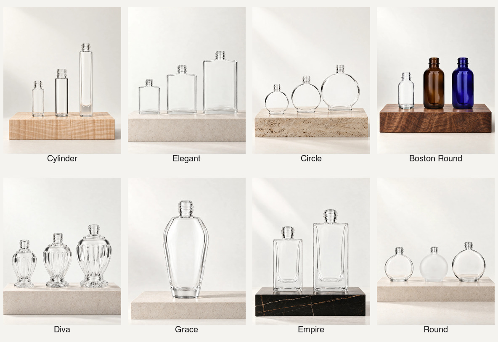

# Bottle family portrait imagery

All eight family navigation images were regenerated using GPT Image 2.5 Sunburst with original bare-body PSD layer references. The live Figma Material system board (4:12 on page 3:54) informed the material pairings.

- Cylinder: Curly Maple
- Circle: Travertine Navona
- Empire: Sahara Noir
- Boston Round: Figured Claro Walnut
- Elegant, Diva, Grace and Round: neutral pale stone, the extended-family Figma default for review

The new artwork is native 4:5 and delivered at 1000 by 1250 pixels. Family cards retain their existing widths. Images use contain so their complete canvases remain visible; menu thumbnails use the same protection. Sanity family images now request width only instead of a forced server crop.

Three source bodies are shown where supported, two for Empire and one for Grace. This avoids inventing extra sizes. Original source hashes, reference sheets, model settings, prompts, output hashes and job IDs are recorded in family-portrait-material-system.json.

After user review identified reducer-like inserts, Elegant, Diva, Grace, Empire and Round were revised to show hollow glass mouths without plastic plugs. Their existing compositions and material bases were retained. Boston Round was regenerated with clear 30 mL, amber 60 mL and cobalt blue 60 mL source bodies; the two colored bottles share the same size and profile. Versioned asset names prevent the previous images remaining cached. The JSON revision history preserves the superseded outputs and source selections.

These are editorial navigation scenes, not SKU product plates or verified dimension diagrams. Prompt dimensions guide relative scale; Boston 30mL source measurements remain approximate. No catalog records, physical height locks, Shopify media, Convex or production assets were changed.

## Verification

Homepage HTTP 200. All eight images loaded at 1440px desktop and 390px mobile; every image rendered at 4:5 with contain, and neither viewport had horizontal document overflow. Both carousel buttons worked. All eight directory cards and menu thumbnails loaded; Escape closed the menu. Rendered cards were visually inspected for complete bottle necks, bodies and bases. Scoped ESLint, TypeScript and diff whitespace checks passed.

Local preview: http://localhost:3042/#family-heading

PR preparation: the production Webpack build passed in an isolated checkout of the staged changes. Repository TypeScript and lint passed (lint reported 60 warnings and no errors). The full unit run passed 1,586 tests with seven skipped and one PDP timeout; the affected PDP file passed all three tests when rerun alone. Earlier PR failures were resolved by completing the empty collection-filter state and updating obsolete homepage/label expectations.

