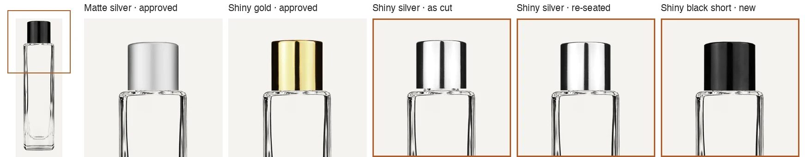
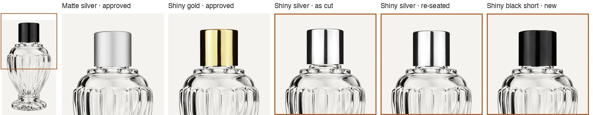
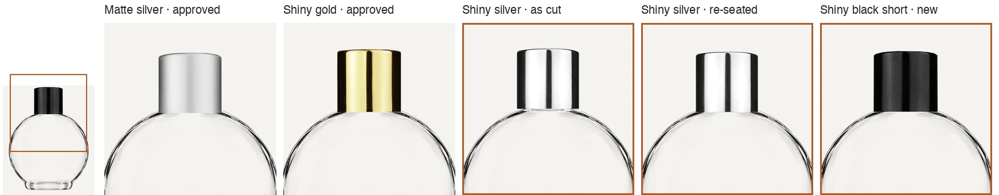

# Library refresh, 28 Sep 2026

The component library (register) rebuilt from production's catalogue export (2,484 rows, 2026-09-28 20:11 UTC), with the two short 18-415 caps Jordan approved on 28 Sep. Dry-run report: https://claude.ai/artifact/9wm8KymJWTTxu3iKcQfByj

## What it unlocks

Of the 148 product-page SKUs the 27 Sep size audit found drawing a store photo or an old per-SKU kit (the 104 short-cap SKUs the Blender work covers are counted separately):

| | SKUs |
|---|---:|
| Draw on the library push alone (9 frosted Circle 50 mL tassel sprayers, `LBElg60LtnClrOvrCap`, `LBSlm100MtSlClOvrCap`, `GBPillar9SpryBlkMatt`) | 12 |
| With the short shiny black cap (new library part, approved 28 Sep) | 26 |
| With the shiny silver short cap, re-seated (approved 28 Sep) | 25 |
| With the 9 mL roll-on insert layers promoted to production (dev holds 8 per insert, production 1) | 10 |
| Still blocked: 20-400, 15-415, 18-400 and 12 mm rules; Minaret caps; ring sprayers; white pumps under clear overcaps; quarantined vials | 75 |

## The two caps

Every short cap on every glass that sells a short-cap reducer, at one zoom per glass (`strips/`). The thumbnail marks the area shown. Matte silver and shiny gold are the approved references.

- **Short shiny black cap, `LIB-18-415-ShnBlkCap`.** The catalogue sells only the tall black cap as a part (`CP18-415ShnBlkTall`); the master library holds the short one (`20. Caps/6. 18-415 Caps/3. CP18-415ShnBlk.psd`). Registered as a library part, cut against the Circle 100 master photo (`GBCrcl100RdcrShnBlk`), registration IoU 0.933. It draws the 29 short shiny black reducers.
- **Shiny silver short cap, `CMP-CAP-SSLV-18415-S`.** As cut (IoU 0.847, below the 0.90 check) its solid skirt reached 16.69 mm below the rim where every other 18-415 cap reaches 17.7–18.2, so it rode 1.2 mm high and showed a band of neck. Re-seated to the mean reach of the matte silver, shiny gold and short shiny black caps (17.92 mm): anchor y 58.5 → 46.7 px (`clean_layers.py --reseat`, recorded in `checks.reseat`). The review sheet showed 46.8, 0.005 mm away.

## What the push changes (checked against production, read-only)

- Resolved builds 1,839 → 1,956: 121 new and 1 re-pointed (the Pillar 9 mL sprayer onto its 13-415 body). Of those, 14 draw at once, 29 when the black cap's layer loads, and 79 when the Blender short caps land.
- No SKU that draws today stops drawing. All 83 bottles whose body, glass or parts change were checked. Three builds the catalogue broke between the 25 and 28 Sep exports are held back by the push's new guard: `GBCylSwrl9RollWht` and `GBCylSwrl9MtlRollWht` became "Dot Cap" (the metal one also "Plastic Roller Ball"), and `GBCrclFrst50RdcrIvyLthr` moved to an 18-400 neck.
- 24 parts the catalogue re-keyed keep their library ids. The approved layers hang on the old ids; production's rows for the new ids are retired and empty.
- The push only adds and updates. It leaves in place 128 assemblies, 5 bodies and 24 components the rebuild no longer has, all retired or re-keyed.
